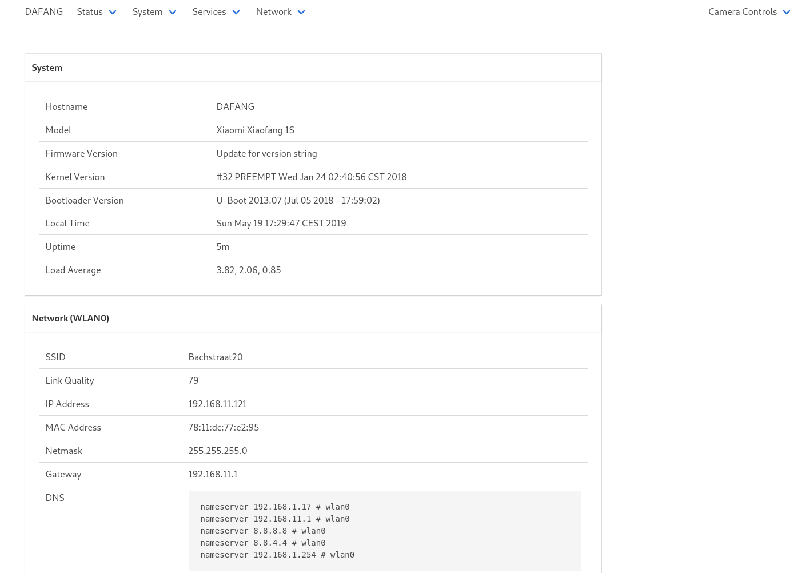

# Xiaomi Xiaofang s1 hack
Xiaomi Mijia Xiaofang 1 S 110 degrees F2.0 8X 1080 P Digitale Zoom Smart Camera IP WIFI 
https://github.com/EliasKotlyar/Xiaomi-Dafang-Hacks

---

### Camera view with controll settings


---

### T20 board

* T20 board
* i9C5C-MCUP01 V1.9 i9C5C B01
* 2018-10-10


Serial pins right bottom corner (top to bottom):

* GND
* TX
* RX


Serial pins upper left corner (left to right):

* RX
* TX
* GND

---

### Camera boards


* lSC5S-B02
* WYZEC2-SENPO1 V1.1 
* 2018-09-25


---

### Connect Xiaomi Xiaofang s1 cam to a pc using a serial connection

* Use a serial to usb FTDI-Adapter with 3.3V
* Connect RX to TX, TX to RX and GND to GND
* Install a serial terminal client like 'cu', 'picomco' or 'putty'.
* Confugure the terminal client 115200 N1
* Power up the cam.

---

### Boot log without SD card
```
[root@msi ~]# sudo chmod 666 /dev/ttyUSB0
[root@msi ~]# cu -l /dev/ttyUSB0 -s 115200
Connected.

U-Boot SPL 2013.07 (Jul 05 2018 - 17:59:02)
pll_init:365
l2cache_clk = 375000000
pll_cfg.pdiv = 8, pll_cfg.h2div = 4, pll_cfg.h0div = 4, pll_cfg.cdiv = 1, pll_cfg.l2div = 2
nf=30 nr = 1 od0 = 1 od1 = 1
cppcr is 03c05100
CPM_CPAPCR 03b0890d
nf=42 nr = 1 od0 = 1 od1 = 1
cppcr is 02a04900
CPM_CPMPCR 07d0c90d
nf=50 nr = 1 od0 = 1 od1 = 1
cppcr is 03204900
CPM_CPVPCR 0320490d
cppcr 0x9a794410
apll_freq 712704000 
mpll_freq 1000000000 
vpll_freq = 1200000000
ddr sel mpll, cpu sel apll
ddrfreq 500000000
cclk  712704000
l2clk 356352000
h0clk 250000000
h2clk 250000000
pclk  125000000
DDRC_DLP:0000f003


U-Boot 2013.07 (Jul 05 2018 - 17:59:02)

Board: ISVP (Ingenic XBurst T20 SoC)
DRAM:  64 MiB
Top of RAM usable for U-Boot at: 84000000
Reserving 400k for U-Boot at: 83f98000
Reserving 32784k for malloc() at: 81f94000
Reserving 32 Bytes for Board Info at: 81f93fe0
Reserving 124 Bytes for Global Data at: 81f93f64
Reserving 128k for boot params() at: 81f73f64
Stack Pointer at: 81f73f48
Now running in RAM - U-Boot at: 83f98000
MMC:   msc: 0
the manufacturer c8
SF: Detected GD25Q128

*** Warning - bad CRC, using default environment

In:    serial
Out:   serial
Err:   serial
misc_init_r before change the IR_cut_gpio
gpio_request lable = IR_cut_gpio gpio = 25
misc_init_r after gpio_request the IR_cut_gpio ret is 25
misc_init_r after change the IR_cut_gpio ret is 0
misc_init_r before change the TF_CD_gpio
gpio_request lable = TF_CD_gpio gpio = 43
misc_init_r after gpio_request the TF_CD_gpio ret is 43
misc_init_r after change the TF_CD_gpio ret is 1
misc_init_r before change the SD_enable_gpio
gpio_request lable = SD_able_gpio gpio = 48
misc_init_r after gpio_request the SD_able_gpio ret is 48
misc_init_r after change the SD_able_gpio ret is 0
misc_init_r before change the wifi_reset_gpio
gpio_request lable = wifi_reset_gpio gpio = 46
misc_init_r after gpio_request the wifi_reset_gpio ret is 46
misc_init_r after change the wifi_reset_gpio ret is 1
misc_init_r before change the yellow_gpio
gpio_request lable = yellow_gpio gpio = 38
misc_init_r after gpio_request the yellow_gpio ret is 38
misc_init_r after change the yellow_gpio ret is 0
misc_init_r before change the blue_gpio
gpio_request lable = blue_gpio gpio = 39
misc_init_r after gpio_request the blue_gpio ret is 39
misc_init_r after change the blue_gpio ret is 1
gpio_request lable = night_led_gpio gpio = 81
misc_init_r after gpio_request the night_led_gpio ret is 81
misc_init_r after change the night_led_gpio ret is 0
misc_init_r before change the wifi_enable_gpio
gpio_request lable = wifi_enable_gpio gpio = 62
misc_init_r after gpio_request the wifi_enable_gpio ret is 62
misc_init_r after change the wifi_enable_gpio ret is 0
misc_init_r before change the SPK_able_gpio
gpio_request lable = SPK_able_gpio gpio = 63
misc_init_r after gpio_request the SPK_able_gpio ret is 63
misc_init_r after change the SPK_able_gpio ret is 0
misc_init_r before change the USB_able_gpio
gpio_request lable = USB_able_gpio gpio = 47
misc_init_r after gpio_request the USB_able_gpio ret is 47
misc_init_r after change the USB_able_gpio ret is 0
Hit any key to stop autoboot:  0 
jiabo_do_auto_update!!!!!!!!!!!!!!!!!!!!!!!!
gpio_request lable = sdupgrade gpio = 46
the manufacturer c8
SF: Detected GD25Q128

jiabo_update_to_flash!!!!!!!!!!!!!!!!!!!!!!!!
jiabo_au_do_update!!!!!!!!!!!!!!!!!!!!!!!!
start=0
start=40000
len=40000
flash check read...
FWGRADEUP not find !!!!!!!!!
gradeup check fail!!!!!!!!!!!!!!!!!!!
the manufacturer c8
SF: Detected GD25Q128

Erasing SPI flash...addr align as 10000 !
sfc erase error
the manufacturer c8
SF: Detected GD25Q128

--->probe spend 4 ms
SF: 2621440 bytes @ 0x40000 Read: OK
--->read spend 339 ms
## Booting kernel from Legacy Image at 80600000 ...
   Image Name:   Linux-3.10.14
   Image Type:   MIPS Linux Kernel Image (lzma compressed)
   Data Size:    1806186 Bytes = 1.7 MiB
   Load Address: 80010000
   Entry Point:  803e3aa0
   Verifying Checksum ... OK
   Uncompressing Kernel Image ... OK

Starting kernel ...

[    0.000000] Initializing cgroup subsys cpu
[    0.000000] Initializing cgroup subsys cpuacct
[    0.000000] Linux version 3.10.14 (root@ubuntu) (gcc version 4.7.2 (Ingenic r2.3.3 2016.12) ) #20 PREEMPT Wed Aug 23 17:45:28 CST 2017
[    0.000000] bootconsole [early0] enabled
[    0.000000] CPU0 RESET ERROR PC:4E71C022
[    0.000000] CPU0 revision is: 00d00101 (Ingenic Xburst)
[    0.000000] FPU revision is: 00b70000
[    0.000000] CCLK:712MHz L2CLK:356Mhz H0CLK:200MHz H2CLK:200Mhz PCLK:100Mhz
[    0.000000] Determined physical RAM map:
[    0.000000]  memory: 0051c000 @ 00010000 (usable)
[    0.000000]  memory: 00034000 @ 0052c000 (usable after init)
[    0.000000] User-defined physical RAM map:
[    0.000000]  memory: 028b9000 @ 00000000 (usable)
[    0.000000] Zone ranges:
[    0.000000]   Normal   [mem 0x00000000-0x028b8fff]
[    0.000000] Movable zone start for each node
[    0.000000] Early memory node ranges
[    0.000000]   node   0: [mem 0x00000000-0x028b8fff]
[    0.000000] Primary instruction cache 32kB, 8-way, VIPT, linesize 32 bytes.
[    0.000000] Primary data cache 32kB, 8-way, VIPT, no aliases, linesize 32 bytes
[    0.000000] pls check processor_id[0x00d00101],sc_jz not support!
[    0.000000] MIPS secondary cache 128kB, 8-way, linesize 32 bytes.
[    0.000000] Built 1 zonelists in Zone order, mobility grouping off.  Total pages: 10343
[    0.000000] Kernel command line: console=ttyS1,115200n8 mem=41700K@0x0 ispmem=8M@0x28B9000 rmem=15644K@0x30B9000 init=/linuxrc rootfstype=squashfs root=/dev/mtdblock2 rw mtdparts=jz_sfc:256k(boot),2048k(kernel),3392k(root),640k(driver),4736k(appfs),2048k(backupk),640k(backupd),2048k(backupa),256k(config),256k(para),-(flag)
[    0.000000] PID hash table entries: 256 (order: -2, 1024 bytes)
[    0.000000] Dentry cache hash table entries: 8192 (order: 3, 32768 bytes)
[    0.000000] Inode-cache hash table entries: 4096 (order: 2, 16384 bytes)
[    0.000000] Memory: 35192k/41700k available (3953k kernel code, 6508k reserved, 1274k data, 208k init, 0k highmem)
[    0.000000] SLUB: HWalign=32, Order=0-3, MinObjects=0, CPUs=1, Nodes=1
[    0.000000] Preemptible hierarchical RCU implementation.
[    0.000000] NR_IRQS:418
[    0.000000] clockevents_config_and_register success.
[    0.000028] Calibrating delay loop... 709.42 BogoMIPS (lpj=3547136)
[    0.057699] pid_max: default: 32768 minimum: 301
[    0.062745] Mount-cache hash table entries: 512
[    0.067957] Initializing cgroup subsys debug
[    0.072224] Initializing cgroup subsys freezer
[    0.079782] regulator-dummy: no parameters
[    0.084057] NET: Registered protocol family 16
[    0.109205] bio: create slab <bio-0> at 0
[    0.116095] jz-dma jz-dma: JZ SoC DMA initialized
[    0.121359] SCSI subsystem initialized
[    0.125440] usbcore: registered new interface driver usbfs
[    0.130984] usbcore: registered new interface driver hub
[    0.136484] usbcore: registered new device driver usb
[    0.141791] i2c-gpio i2c-gpio.1: using pins 57 (SDA) and 58 (SCL)
[    0.148092]  (null): set:249  hold:250 dev=100000000 h=500 l=500
[    0.154225] media: Linux media interface: v0.10
[    0.158818] Linux video capture interface: v2.00
[    0.166013] Switching to clocksource jz_clocksource
[    0.171686] jz-dwc2 jz-dwc2: cgu clk gate get error
[    0.176688] cfg80211: Calling CRDA to update world regulatory domain
[    0.183150] jz-dwc2 jz-dwc2: regulator vbus get error
[    0.188208] DWC IN OTG MODE
[    0.341122] sft id =========================off
[    0.345776] dwc2 dwc2: Keep PHY ON
[    0.349150] dwc2 dwc2: Using Buffer DMA mode
[    0.552854] dwc2 dwc2: Core Release: 3.00a
[    0.556972] dwc2 dwc2: DesignWare USB2.0 High-Speed Host Controller
[    0.563333] dwc2 dwc2: new USB bus registered, assigned bus number 1
[    0.570854] hub 1-0:1.0: USB hub found
[    0.574674] hub 1-0:1.0: 1 port detected
[    0.578750] dwc2 dwc2: DWC2 Host Initialized
[    0.583323] NET: Registered protocol family 2
[    0.588370] TCP established hash table entries: 512 (order: 0, 4096 bytes)
[    0.595357] TCP bind hash table entries: 512 (order: -1, 2048 bytes)
[    0.601759] TCP: Hash tables configured (established 512 bind 512)
[    0.608066] TCP: reno registered
[    0.611300] UDP hash table entries: 256 (order: 0, 4096 bytes)
[    0.617202] UDP-Lite hash table entries: 256 (order: 0, 4096 bytes)
[    0.623899] NET: Registered protocol family 1
[    0.628634] RPC: Registered named UNIX socket transport module.
[    0.634660] RPC: Registered udp transport module.
[    0.639353] RPC: Registered tcp transport module.
[    0.644139] RPC: Registered tcp NFSv4.1 backchannel transport module.
[    0.651266] freq_udelay_jiffys[0].max_num = 10
[    0.655696] cpufreq 	udelay 	loops_per_jiffy	
[    0.660127] dwc2 dwc2: ID PIN CHANGED!
[    0.663986] init DWC as A_HOST
[    0.667034] 12000	 59724	 59724	
[    0.670270] 24000	 119448	 119448	
[    0.673848] 60000	 298620	 298620	
[    0.677217] 120000	 597241	 597241	
[    0.680748] 200000	 995402	 995402	
[    0.684405] 300000	 1493103	 1493103	
[    0.688039] 600000	 2986206	 2986206	
[    0.691776] 792000	 3941793	 3941793	
[    0.695455] 1008000	 5016827	 5016827	
[    0.699252] 1200000	 5972413	 5972413	
[    0.709704] squashfs: version 4.0 (2009/01/31) Phillip Lougher
[    0.716815] jffs2: version 2.2. (NAND) © 2001-2006 Red Hat, Inc.
[    0.723510] msgmni has been set to 68
[    0.728829] io scheduler noop registered
[    0.732897] io scheduler cfq registered (default)
[    0.739727] jz-uart.1: ttyS1 at MMIO 0x10031000 (irq = 58) is a uart1
[    0.748388] console [ttyS1] enabled, bootconsole disabled
[    0.748388] console [ttyS1] enabled, bootconsole disabled
[    0.764593] brd: module loaded
[    0.770250] loop: module loaded
[    0.774582] zram: Created 2 device(s) ...
[    0.778817] logger: created 256K log 'log_main'
[    0.784348] jz SADC driver registeres over!
[    0.789874] jz TCU driver register completed
[    0.795051] the id code = c84018, the flash name is GD25Q127C
[    0.801058] JZ SFC Controller for SFC channel 0 driver register
[    0.807191] 11 cmdlinepart partitions found on MTD device jz_sfc
[    0.813401] Creating 11 MTD partitions on "jz_sfc":
[    0.818430] 0x000000000000-0x000000040000 : "boot"
[    0.824081] 0x000000040000-0x000000240000 : "kernel"
[    0.829805] 0x000000240000-0x000000590000 : "root"
[    0.835447] 0x000000590000-0x000000630000 : "driver"
[    0.841282] 0x000000630000-0x000000ad0000 : "appfs"
[    0.846955] 0x000000ad0000-0x000000cd0000 : "backupk"
[    0.852885] 0x000000cd0000-0x000000d70000 : "backupd"
[    0.858740] 0x000000d70000-0x000000f70000 : "backupa"
[    0.864660] 0x000000f70000-0x000000fb0000 : "config"
[    0.870481] 0x000000fb0000-0x000000ff0000 : "para"
[    0.876166] 0x000000ff0000-0x000001000000 : "flag"
[    0.881794] SPI NOR MTD LOAD OK
[    0.885111] tun: Universal TUN/TAP device driver, 1.6
[    0.890310] tun: (C) 1999-2004 Max Krasnyansky <maxk@qualcomm.com>
[    0.896901] usbcore: registered new interface driver zd1201
[    0.902727] usbcore: registered new interface driver r8152
[    0.908469] usbcore: registered new interface driver usb-storage
[    0.914828] usbcore: registered new interface driver usbserial
[    0.920880] usbcore: registered new interface driver usbserial_generic
[    0.927693] usbserial: USB Serial support registered for generic
[    0.933949] usbcore: registered new interface driver ch341
[    0.939631] usbserial: USB Serial support registered for ch341-uart
[    0.946142] usbcore: registered new interface driver cp210x
[    0.951933] usbserial: USB Serial support registered for cp210x
[    0.958093] usbcore: registered new interface driver pl2303
[    0.963896] usbserial: USB Serial support registered for pl2303
[    1.469920] i8042: i8042 controller selftest timeout
[    1.475644] jzmmc_v1.2 jzmmc_v1.2.0: vmmc regulator missing
[    1.521071] jzmmc_v1.2 jzmmc_v1.2.0: register success!
[    1.526435] jzmmc_v1.2 jzmmc_v1.2.1: vmmc regulator missing
[    1.571978] jzmmc_v1.2 jzmmc_v1.2.1: register success!
[    1.577456] hidraw: raw HID events driver (C) Jiri Kosina
[    1.583356] usbcore: registered new interface driver usbhid
[    1.589096] usbhid: USB HID core driver
[    1.593394] TCP: cubic registered
[    1.596817] NET: Registered protocol family 17
[    1.602640] input: gpio-keys as /devices/platform/gpio-keys/input/input0
[    1.609790] drivers/rtc/hctosys.c: unable to open rtc device (rtc0)
[    1.621784] VFS: Mounted root (squashfs filesystem) readonly on device 31:2.
[    1.629482] Freeing unused kernel memory: 208K (8052c000 - 80560000)
[    1.773719] dwc2 dwc2:  ++OTG Interrupt: A-Device Timeout Change++
mdev is ok......

Ingenic-uc1_1 login: [    3.075965] register all isp device successfully!
[    3.083945] @@@@ tx-isp-probe ok @@@@@
[    3.203640] exFAT: Version 1.2.9
[    3.251080] motor_probe731
[    3.299377] jz_codec_register: probe() successful!
[    3.651485] dma dma0chan24: Channel 24 have been requested.(phy id 7,type 0x06 desc a27b9000)
[    3.660772] dma dma0chan25: Channel 25 have been requested.(phy id 6,type 0x06 desc a27b8000)
[    4.141452] RTL871X: module init start
[    4.145326] RTL871X: rtl8189es v4.3.18.3_20185.20161116_pmpinclu_mac_monitor_minMem_EDCA542B_pbyr
[    4.154540] RTL871X: build time: Apr 21 2017 10:31:29
[    4.159750] wlan power on
[    4.181712] RTL871X: module init ret=0
[    4.226758] mmc1: card claims to support voltages below the defined range. These will be ignored.
[    4.248923] mmc1: new SDIO card at address 0001
GPIO 40   in  
GPIO 26   out  
GPIO 25   out  
GPIO 49   out  
GPIO 47   out  
GPIO 48   out  
GPIO 43   out  
right_count=3  value=0 last_value=0
right_count=3  value=0 last_value=0
right_count=3  value=0 last_value=0
right_count=3  value=0 last_value=0
right_count=3  value=0 last_value=0
right_count=3  value=0 last_value=0
right_count=3  value=0 last_value=0
right_count=3  value=0 last_value=0
right_count=3  value=0 last_value=0
right_count=3  value=0 last_value=0
not in singleboard test
hello Guozhixin OKOKOKOKOKOKOKOKOKOK
xxq:begin to check the sensor ty[    8.062583] name : i2c-gpio1 nr : 1
pe
[    8.071638] name : i2c0 nr : 0
[    8.135449]  sensor_read: addr=0xa value = 0xf
[    8.140431]  sensor_read: addr=0xb value = 0x23
[    8.205115] i2c i2c-0: i2c_jz_irq 441, I2C transfer error, ABORT interrupt
[    8.212220] i2c i2c-0: --I2C txabrt:
[    8.215908] i2c i2c-0: --I2C TXABRT[0]=I2C_TXABRT_ABRT_7B_ADDR_NOACK
[    8.222478] error: sensor_read,146 ret = -5
[    8.226783]  sensor_read: addr=0x0 value = 0x0
[    8.231372] err sensor read addr = 0x0, value = 0x0
[    8.296379] i2c i2c-0: i2c_jz_irq 441, I2C transfer error, ABORT interrupt
[    8.303480] i2c i2c-0: --I2C txabrt:
[    8.307167] i2c i2c-0: --I2C TXABRT[0]=I2C_TXABRT_ABRT_7B_ADDR_NOACK
[    8.313735] error: sensor_read,146 ret = -5
[    8.318042]  sensor_read: addr=0x0 value = 0x0
[    8.322631] err sensor read addr = 0x0, value = 0x0
[    8.387638] i2c i2c-0: i2c_jz_irq 441, I2C transfer error, ABORT interrupt
[    8.394738] i2c i2c-0: --I2C txabrt:
[    8.398426] i2c i2c-0: --I2C TXABRT[0]=I2C_TXABRT_ABRT_7B_ADDR_NOACK
[    8.404996] error: sensor_read,146 ret = -5
[    8.409303]  sensor_read: addr=0x3107 value = 0x0
[    8.414158] err sensor read addr = 0x3107, value = 0x0
[    8.479434] i2c i2c-0: i2c_jz_irq 441, I2C transfer error, ABORT interrupt
[    8.486534] i2c i2c-0: --I2C txabrt:
[    8.490221] i2c i2c-0: --I2C TXABRT[0]=I2C_TXABRT_ABRT_7B_ADDR_NOACK
[    8.496792] error: sensor_read,146 ret = -5
[    8.501112]  sensor_read: addr=0x3107 value = 0x0
[    8.505954] err sensor read addr = 0x3107, value = 0x0
[    8.571256] i2c i2c-0: i2c_jz_irq 441, I2C transfer error, ABORT interrupt
[    8.578341] i2c i2c-0: --I2C txabrt:
[    8.582041] i2c i2c-0: --I2C TXABRT[0]=I2C_TXABRT_ABRT_7B_ADDR_NOACK
[    8.588594] error: sensor_read,146 ret = -5
[    8.592913]  sensor_read: addr=0x301c value = 0x0
[    8.597756] err sensor read addr = 0x301c, value = 0x0
[    8.663126] i2c i2c-0: i2c_jz_irq 441, I2C transfer error, ABORT interrupt
[    8.670214] i2c i2c-0: --I2C txabrt:
[    8.673918] i2c i2c-0: --I2C TXABRT[0]=I2C_TXABRT_ABRT_7B_ADDR_NOACK
[    8.680473] error: sens:or_read,146 ret = -5
[    8.684796]  sensor_read: addr=0x301c value = 0x0
[    8.689639] err sensor read addr = 0x301c, value = 0x0
[    8.694948] info: failed sensor find
##### sensor not found
[    8.698784] misc sinfo_release
Not have the sensor driver!!!
```

---

### Login
Username: root Password: ismart12
```
Ingenic-uc1_1 login: root
Password: 
Jan  1 08:03:54 login[62]: root login on 'console'
[root@Ingenic-uc1_1:~]#
```

---

### Memory
```
[root@Ingenic-uc1_1:/]# cat /proc/cmdline 
console=ttyS1,115200n8 mem=41700K@0x0 ispmem=8M@0x28B9000 rmem=15644K@0x30B9000 init=/linuxrc rootfstype=squashfs root=/dev/mtdblock2 rw mtdparts=jz_sfc:256k(boot),2048k(kernel),3392k(root),640k(driver),4736k(appfs),2048k(backupk),640k(backupd),2048k(backupa),256k(config),256k(para),-(flag)
[root@Ingenic-uc1_1:/]# 
```
41700K + 8M + 15644K = 65536K = 64M model

---

### Flash firmware: install bootload from microSD

* Format your microSD to FAT32. NTFS, EXFAT etc. won't work. Try to use smaller older SD cards like 512 MB or create just a single primary 400 MB partition (using gparted).
* Download https://github.com/EliasKotlyar/Xiaomi-Dafang-Hacks/raw/master/hacks/cfw/xiaofang/cfw-1.0.bin
* Copy the CFW-Binary from the prevois step to the formatted microSD card and rename it to "demo.bin". There must not be other files on the microSD! 
* Remove the power cable from the camera and plug the microSD card into the camera.
* Hold down the setup button on the camera while.
* Plugging in the USB power cable.
* Keep the setup button pressed for another 20 seconds.
* Wait until the firmware has finished flashing (like 3 minutes). 
* Remove the microSD card and power up the camera.

```
[root@msi ~]# cu -l /dev/ttyUSB0 -s 115200
Connected.

U-Boot SPL 2013.07 (Jul 05 2018 - 17:59:02)
pll_init:365
l2cache_clk = 375000000
pll_cfg.pdiv = 8, pll_cfg.h2div = 4, pll_cfg.h0div = 4, pll_cfg.cdiv = 1, pll_cfg.l2div = 2
nf=30 nr = 1 od0 = 1 od1 = 1
cppcr is 03c05100
CPM_CPAPCR 03b0890d
nf=42 nr = 1 od0 = 1 od1 = 1
cppcr is 02a04900
CPM_CPMPCR 07d0c90d
nf=50 nr = 1 od0 = 1 od1 = 1
cppcr is 03204900
CPM_CPVPCR 0320490d
cppcr 0x9a794410
apll_freq 712704000 
mpll_freq 1000000000 
vpll_freq = 1200000000
ddr sel mpll, cpu sel apll
ddrfreq 500000000
cclk  712704000
l2clk 356352000
h0clk 250000000
h2clk 250000000
pclk  125000000
DDRC_DLP:0000f003


U-Boot 2013.07 (Jul 05 2018 - 17:59:02)

Board: ISVP (Ingenic XBurst T20 SoC)
DRAM:  64 MiB
Top of RAM usable for U-Boot at: 84000000
Reserving 400k for U-Boot at: 83f98000
Reserving 32784k for malloc() at: 81f94000
Reserving 32 Bytes for Board Info at: 81f93fe0
Reserving 124 Bytes for Global Data at: 81f93f64
Reserving 128k for boot params() at: 81f73f64
Stack Pointer at: 81f73f48
Now running in RAM - U-Boot at: 83f98000
MMC:   msc: 0
the manufacturer c8
SF: Detected GD25Q128

*** Warning - bad CRC, using default environment

In:    serial
Out:   serial
Err:   serial
misc_init_r before change the IR_cut_gpio
gpio_request lable = IR_cut_gpio gpio = 25
misc_init_r after gpio_request the IR_cut_gpio ret is 25
misc_init_r after change the IR_cut_gpio ret is 0
misc_init_r before change the TF_CD_gpio
gpio_request lable = TF_CD_gpio gpio = 43
misc_init_r after gpio_request the TF_CD_gpio ret is 43
misc_init_r after change the TF_CD_gpio ret is 0
misc_init_r before change the SD_enable_gpio
gpio_request lable = SD_able_gpio gpio = 48
misc_init_r after gpio_request the SD_able_gpio ret is 48
misc_init_r after change the SD_able_gpio ret is 0
misc_init_r before change the wifi_reset_gpio
gpio_request lable = wifi_reset_gpio gpio = 46
misc_init_r after gpio_request the wifi_reset_gpio ret is 46
misc_init_r after change the wifi_reset_gpio ret is 0
misc_init_r before change the yellow_gpio
gpio_request lable = yellow_gpio gpio = 38
misc_init_r after gpio_request the yellow_gpio ret is 38
misc_init_r after change the yellow_gpio ret is 0
misc_init_r before change the blue_gpio
gpio_request lable = blue_gpio gpio = 39
misc_init_r after gpio_request the blue_gpio ret is 39
misc_init_r after change the blue_gpio ret is 1
gpio_request lable = night_led_gpio gpio = 81
misc_init_r after gpio_request the night_led_gpio ret is 81
misc_init_r after change the night_led_gpio ret is 0
misc_init_r before change the wifi_enable_gpio
gpio_request lable = wifi_enable_gpio gpio = 62
misc_init_r after gpio_request the wifi_enable_gpio ret is 62
misc_init_r after change the wifi_enable_gpio ret is 0
misc_init_r before change the SPK_able_gpio
gpio_request lable = SPK_able_gpio gpio = 63
misc_init_r after gpio_request the SPK_able_gpio ret is 63
misc_init_r after change the SPK_able_gpio ret is 0
misc_init_r before change the USB_able_gpio
gpio_request lable = USB_able_gpio gpio = 47
misc_init_r after gpio_request the USB_able_gpio ret is 47
misc_init_r after change the USB_able_gpio ret is 0
Hit any key to stop autoboot:  0 
jiabo_do_auto_update!!!!!!!!!!!!!!!!!!!!!!!!
gpio_request lable = sdupgrade gpio = 46
setup_button set long!!!!!!!!!!!!!!!!!!!
Interface:  MMC
  Device 0: Vendor: Man 000003 Snr f4048201 Rev: 5.2 Prod: SC32G�
            Type: Removable Hard Disk
            Capacity: 30436.5 MB = 29.7 GB (62333952 x 512)
Filesystem: FAT32 "NO NAME    "
the manufacturer c8
SF: Detected GD25Q128

reading demo.bin
reading demo.bin
jiabo_au_check_cksum_valid!!!!!!!!!!!!!!!!!!!!!!!!
jiabo_idx=4
misc_init_r before change the blue_gpio
gpio_request lable = blue_gpio gpio = 39
misc_init_r after gpio_request the blue_gpio ret is 39
misc_init_r after change the blue_gpio ret is 0
jiabo_start=40000,jiabo_len=a90000
flash erase...
flash write...
misc_init_r after change the blue_gpio ret is 1
the manufacturer c8
SF: Detected GD25Q128

--->probe spend 4 ms
SF: 2621440 bytes @ 0x40000 Read: OK
--->read spend 339 ms
## Booting kernel from Legacy Image at 80600000 ...
   Image Name:   Linux-3.10.14
   Image Type:   MIPS Linux Kernel Image (lzma compressed)
   Data Size:    1804956 Bytes = 1.7 MiB
   Load Address: 80010000
   Entry Point:  803e3200
   Verifying Checksum ... OK
   Uncompressing Kernel Image ... OK

Starting kernel ...

[    0.000000] Initializing cgroup subsys cpu
[    0.000000] Initializing cgroup subsys cpuacct
[    0.000000] Linux version 3.10.14 (taozhang@zhangtao-ThinkPad-X220) (gcc version 4.7.2 (Ingenic r2.3.3 2016.12) ) #32 PREEMPT Wed Jan 24 02:40:56 CST 2018
[    0.000000] bootconsole [early0] enabled
[    0.000000] CPU0 RESET ERROR PC:EAEDE822
[    0.000000] CPU0 revision is: 00d00101 (Ingenic Xburst)
[    0.000000] FPU revision is: 00b70000
[    0.000000] CCLK:712MHz L2CLK:356Mhz H0CLK:200MHz H2CLK:200Mhz PCLK:100Mhz
[    0.000000] Determined physical RAM map:
[    0.000000]  memory: 0051b000 @ 00010000 (usable)
[    0.000000]  memory: 00035000 @ 0052b000 (usable after init)
[    0.000000] User-defined physical RAM map:
[    0.000000]  memory: 028b9000 @ 00000000 (usable)
[    0.000000] Zone ranges:
[    0.000000]   Normal   [mem 0x00000000-0x028b8fff]
[    0.000000] Movable zone start for each node
[    0.000000] Early memory node ranges
[    0.000000]   node   0: [mem 0x00000000-0x028b8fff]
[    0.000000] Primary instruction cache 32kB, 8-way, VIPT, linesize 32 bytes.
[    0.000000] Primary data cache 32kB, 8-way, VIPT, no aliases, linesize 32 bytes
[    0.000000] pls check processor_id[0x00d00101],sc_jz not support!
[    0.000000] MIPS secondary cache 128kB, 8-way, linesize 32 bytes.
[    0.000000] Built 1 zonelists in Zone order, mobility grouping off.  Total pages: 10343
[    0.000000] Kernel command line: console=ttyS1,115200n8 mem=41700K@0x0 ispmem=8M@0x28B9000 rmem=15644K@0x30B9000 init=/linuxrc rootfstype=squashfs root=/dev/mtdblock2 rw mtdparts=jz_sfc:256k(boot),2048k(kernel),3392k(root),640k(driver),4736k(appfs),2048k(backupk),640k(backupd),2048k(backupa),256k(config),256k(para),-(flag)
[    0.000000] PID hash table entries: 256 (order: -2, 1024 bytes)
[    0.000000] Dentry cache hash table entries: 8192 (order: 3, 32768 bytes)
[    0.000000] Inode-cache hash table entries: 4096 (order: 2, 16384 bytes)
[    0.000000] Memory: 35192k/41700k available (3951k kernel code, 6508k reserved, 1275k data, 212k init, 0k highmem)
[    0.000000] SLUB: HWalign=32, Order=0-3, MinObjects=0, CPUs=1, Nodes=1
[    0.000000] Preemptible hierarchical RCU implementation.
[    0.000000] NR_IRQS:418
[    0.000000] clockevents_config_and_register success.
[    0.000028] Calibrating delay loop... 709.42 BogoMIPS (lpj=3547136)
[    0.057700] pid_max: default: 32768 minimum: 301
[    0.062745] Mount-cache hash table entries: 512
[    0.067961] Initializing cgroup subsys debug
[    0.072227] Initializing cgroup subsys freezer
[    0.079776] regulator-dummy: no parameters
[    0.084054] NET: Registered protocol family 16
[    0.109154] bio: create slab <bio-0> at 0
[    0.116025] jz-dma jz-dma: JZ SoC DMA initialized
[    0.121290] SCSI subsystem initialized
[    0.125370] usbcore: registered new interface driver usbfs
[    0.130914] usbcore: registered new interface driver hub
[    0.136416] usbcore: registered new device driver usb
[    0.141722] i2c-gpio i2c-gpio.1: using pins 57 (SDA) and 58 (SCL)
[    0.148014]  (null): set:249  hold:250 dev=100000000 h=500 l=500
[    0.154143] media: Linux media interface: v0.10
[    0.158746] Linux video capture interface: v2.00
[    0.165938] Switching to clocksource jz_clocksource
[    0.171606] jz-dwc2 jz-dwc2: cgu clk gate get error
[    0.176610] cfg80211: Calling CRDA to update world regulatory domain
[    0.183073] jz-dwc2 jz-dwc2: regulator vbus get error
[    0.188131] DWC IN OTG MODE
[    0.341044] sft id =========================off
[    0.345666] dwc2 dwc2: Keep PHY ON
[    0.349040] dwc2 dwc2: Using Buffer DMA mode
[    0.552739] dwc2 dwc2: Core Release: 3.00a
[    0.556856] dwc2 dwc2: DesignWare USB2.0 High-Speed Host Controller
[    0.563215] dwc2 dwc2: new USB bus registered, assigned bus number 1
[    0.570758] hub 1-0:1.0: USB hub found
[    0.574578] hub 1-0:1.0: 1 port detected
[    0.578644] dwc2 dwc2: DWC2 Host Initialized
[    0.583218] NET: Registered protocol family 2
[    0.588278] TCP established hash table entries: 512 (order: 0, 4096 bytes)
[    0.595266] TCP bind hash table entries: 512 (order: -1, 2048 bytes)
[    0.601667] TCP: Hash tables configured (established 512 bind 512)
[    0.607974] TCP: reno registered
[    0.611210] UDP hash table entries: 256 (order: 0, 4096 bytes)
[    0.617110] UDP-Lite hash table entries: 256 (order: 0, 4096 bytes)
[    0.623810] NET: Registered protocol family 1
[    0.628544] RPC: Registered named UNIX socket transport module.
[    0.634566] RPC: Registered udp transport module.
[    0.639259] RPC: Registered tcp transport module.
[    0.644046] RPC: Registered tcp NFSv4.1 backchannel transport module.
[    0.651172] freq_udelay_jiffys[0].max_num = 10
[    0.655602] cpufreq 	udelay 	loops_per_jiffy	
[    0.660033] dwc2 dwc2: ID PIN CHANGED!
[    0.663893] init DWC as A_HOST
[    0.666940] 12000	 59724	 59724	
[    0.670178] 24000	 119448	 119448	
[    0.673754] 60000	 298620	 298620	
[    0.677124] 120000	 597241	 597241	
[    0.680656] 200000	 995402	 995402	
[    0.684311] 300000	 1493103	 1493103	
[    0.687945] 600000	 2986206	 2986206	
[    0.691681] 792000	 3941793	 3941793	
[    0.695362] 1008000	 5016827	 5016827	
[    0.699158] 1200000	 5972413	 5972413	
[    0.709603] squashfs: version 4.0 (2009/01/31) Phillip Lougher
[    0.716719] jffs2: version 2.2. (NAND) © 2001-2006 Red Hat, Inc.
[    0.723421] msgmni has been set to 68
[    0.728738] io scheduler noop registered
[    0.732808] io scheduler cfq registered (default)
[    0.739585] jz-uart.1: ttyS1 at MMIO 0x10031000 (irq = 58) is a uart1
[    0.748243] console [ttyS1] enabled, bootconsole disabled
[    0.748243] console [ttyS1] enabled, bootconsole disabled
[    0.764437] brd: module loaded
[    0.770097] loop: module loaded
[    0.774427] zram: Created 2 device(s) ...
[    0.778656] logger: created 256K log 'log_main'
[    0.784155] jz SADC driver registeres over!
[    0.789625] jz TCU driver register completed
[    0.794804] the id code = c84018, the flash name is GD25Q127C
[    0.800728] JZ SFC Controller for SFC channel 0 driver register
[    0.806941] 11 cmdlinepart partitions found on MTD device jz_sfc
[    0.813149] Creating 11 MTD partitions on "jz_sfc":
[    0.818178] 0x000000000000-0x000000040000 : "boot"
[    0.823804] 0x000000040000-0x000000240000 : "kernel"
[    0.829541] 0x000000240000-0x000000590000 : "root"
[    0.835177] 0x000000590000-0x000000630000 : "driver"
[    0.840993] 0x000000630000-0x000000ad0000 : "appfs"
[    0.846693] 0x000000ad0000-0x000000cd0000 : "backupk"
[    0.852601] 0x000000cd0000-0x000000d70000 : "backupd"
[    0.858452] 0x000000d70000-0x000000f70000 : "backupa"
[    0.864381] 0x000000f70000-0x000000fb0000 : "config"
[    0.870196] 0x000000fb0000-0x000000ff0000 : "para"
[    0.875881] 0x000000ff0000-0x000001000000 : "flag"
[    0.881521] SPI NOR MTD LOAD OK
[    0.884839] tun: Universal TUN/TAP device driver, 1.6
[    0.890039] tun: (C) 1999-2004 Max Krasnyansky <maxk@qualcomm.com>
[    0.896609] usbcore: registered new interface driver zd1201
[    0.902441] usbcore: registered new interface driver r8152
[    0.908189] usbcore: registered new interface driver usb-storage
[    0.914565] usbcore: registered new interface driver usbserial
[    0.920615] usbcore: registered new interface driver usbserial_generic
[    0.927418] usbserial: USB Serial support registered for generic
[    0.933671] usbcore: registered new interface driver ch341
[    0.939355] usbserial: USB Serial support registered for ch341-uart
[    0.945867] usbcore: registered new interface driver cp210x
[    0.951667] usbserial: USB Serial support registered for cp210x
[    0.957815] usbcore: registered new interface driver pl2303
[    0.963615] usbserial: USB Serial support registered for pl2303
[    1.469622] i8042: i8042 controller selftest timeout
[    1.475351] jzmmc_v1.2 jzmmc_v1.2.0: vmmc regulator missing
[    1.490872] jzmmc_v1.2 jzmmc_v1.2.0: card inserted, state=0
[    1.520878] jzmmc_v1.2 jzmmc_v1.2.0: register success!
[    1.526248] jzmmc_v1.2 jzmmc_v1.2.1: vmmc regulator missing
[    1.570987] jzmmc_v1.2 jzmmc_v1.2.1: register success!
[    1.576456] hidraw: raw HID events driver (C) Jiri Kosina
[    1.583442] usbcore: registered new interface driver usbhid
[    1.589182] usbhid: USB HID core driver
[    1.593486] TCP: cubic registered
[    1.596906] NET: Registered protocol family 17
[    1.602737] input: gpio-keys as /devices/platform/gpio-keys/input/input0
[    1.609878] drivers/rtc/hctosys.c: unable to open rtc device (rtc0)
[    1.623075] VFS: Mounted root (squashfs filesystem) readonly on device 31:2.
[    1.630782] Freeing unused kernel memory: 212K (8052b000 - 80560000)
[    1.773565] dwc2 dwc2:  ++OTG Interrupt: A-Device Timeout Change++
mdev is ok......
[    2.574425] mmc0: new high speed SDHC card at address aaaa
[    2.583941] mmcblk0: mmc0:aaaa SC32G 29.7 GiB 
[    2.593896]  mmcblk0: p1
Trying to mount SDCard...
Mount sucessful
Couldnt find run.sh, starting normal...

Ingenic-uc1_1 login: [    4.268330] register all isp device successfully!
[    4.276199] @@@@ tx-isp-probe ok @@@@@
[    4.336575] exFAT: Version 1.2.9
[    4.372466] motor_probe731
[    4.418320] jz_codec_register: probe() successful!
[    4.771350] dma dma0chan24: Channel 24 have been requested.(phy id 7,type 0x06 desc a1d24000)
[    4.780641] dma dma0chan25: Channel 25 have been requested.(phy id 6,type 0x06 desc a1d23000)
[    4.809889] jz_pwm_probe[198] d_name = tcu_chn0
[    4.826783] request pwm channel 0 successfully
[    4.834527] pwm-jz pwm-jz: jz_pwm_probe register ok !
[    5.288215] RTL871X: module init start
[    5.292193] RTL871X: rtl8189ftv v4.3.24.7_21113.20170208.nova.1.01
[    5.298557] RTL871X: build time: Nov 22 2017 16:25:23
[    5.303833] wlan power on
[    5.321388] RTL871X: module init ret=0
/system/init/app_init.sh: line 24: /system/bin/singleBoadTest: not found
[    5.366743] mmc1: card claims to support voltages below the defined range. These will be ignored.
[    5.387847] mmc1: new SDIO card at address 0001
[    5.397051] RTL871X: ++++++++rtw_drv_init: vendor=0x024c device=0xf179 class=0x07
[    5.478800] RTL871X: HW EFUSE
[    5.482350] RTL871X: hal_com_config_channel_plan chplan:0x20
[    5.701849] RTL871X: rtw_regsty_chk_target_tx_power_valid return _FALSE for band:0, path:0, rs:0, t:-1
[    5.722748] RTL871X: rtw_ndev_init(wlan0) if1 mac_addr=c8:02:8f:10:ad:d7
hello Guozhixin OKOKOKOKOKOKOKOKOKOK
start **********************************************************[    8.619056] name : i2c-gpio1 nr : 1
*********************the TZ is : UTC=UTC-8:00
-----------------[    8.628063] name : i2c0 nr : 0
--------------------------------------------------
xxq:begin to check the sensor type
[    8.697616]  sensor_read: addr=0xa value = 0xf
[    8.702640]  sensor_read: addr=0xb value = 0x23
[    8.707326] info: success sensor find : jxf23
##### sensor : jxf23
[    8.712078] misc sinfo_release
[Add driver] insmod /driver/sensor_jxf23.ko 
[    8.740214] zram0: detected capacity change from 0 to 16777216
Setting up swapspace version 1, size = 16773120 bytes
UUID=663292d1-0c21-4236-9a3e-c3346804b1d4
[    8.762628] Adding 16380k swap on /dev/zram0.  Priority:-1 extents:1 across:16380k SS
iCamera.c,253:icamera_init
iCamera.c,256:TaskPool=c27de0
msg_queue.c,211:msg_queue_remove_by_key_a: No such file or directory

msg_queue.c,211:msg_queue_remove_by_key_a: No such file or directory

msg_queue.c,211:msg_queue_remove_by_key_a: No such file or directory

[watchDog]send watchdog message !!!
hardware_ingenic.c,132:=====IngenicT20 initAllGpio=====
-------------------------------------open gpio 46 direction 
-------------------------------------open gpio 25 direction 
gpio -------------  /sys/class/gpio/gpio25/value  0  
-------------------------------------open gpio 26 direction 
gpio -------------  /sys/class/gpio/gpio26/value  0  
-------------------------------------open gpio 38 direction 
gpio -------------  /sys/class/gpio/gpio38/value  0  
-------------------------------------open gpio 39 direction 
gpio -------------  /sys/class/gpio/gpio39/value  0  
-------------------------------------open gpio 49 direction 
gpio -------------  /sys/class/gpio/gpio49/value  0  
-------------------------------------open gpio 47 direction 
gpio -------------  /sys/class/gpio/gpio47/value  0  
-------------------------------------open gpio 48 direction 
gpio -------------  /sys/class/gpio/gpio48/value  0  
-------------------------------------open gpio 43 direction 
-------------------------------------open gpio 30 direction 
gpio -------------  /sys/class/gpio/gpio30/value  0  
hardware_ingenic.c,317:please modify your Makefile 

pin num == 30
pin num == 30
pin num == 30
pin num == 30
nRead acBuf[nReadLen-1] = a
nRead acBuf[nReadLen-1] = a
[START] test CONFIG_INFO_FIRMWARE = 5.6.2.43
[START] Cam_firmware_HTTP = 5.6.2.43
[START] CONFIG_INFO_FIRMWARE = 5.6.2.43
<<<<<<<<<<<<<<<<<<<<<<<<<<<<>>>>>>>>>>>>>>>>>>>>>>>>>>>>>>>>>
<<<<<<<<<<<<<<<<<<<<<<<<<<<<>>>>>>>>>>>>>>>>>>>>>>>>>>>>>>>>>
<<<<<<<<<<<<<<<<<<<<<<<<<<<<>>>>>>>>>>>>>>>>>>>>>>>>>>>>>>>>>
             FIRM WARE VERSION : 5.6.2.43

<<<<<<<<<<<<<<<<<<<<<<<<<<<<>>>>>>>>>>>>>>>>>>>>>>>>>>>>>>>>>
g_stConfigTable[0] Wifi_Mode = D
g_stConfigTable[1] Wifi_Active = y
g_stConfigTable[2] Wifi_IP = 192.168.1.68
g_stConfigTable[3] Wifi_Subnet = 255.255.255.0
g_stConfigTable[4] Wifi_Gateway = 192.168.1.1
g_stConfigTable[5] Wifi_DNS = 192.168.1.1
g_stConfigTable[6] Wired_IP = 192.168.1.68
g_stConfigTable[7] Wired_Mode = D
g_stConfigTable[8] Wired_Subnet = 255.255.255.0
g_stConfigTable[9] Wired_Gateway = 192.168.1.1
g_stConfigTable[10] Wired_DNS = 192.168.1.1
g_stConfigTable[11] Alarm_Motion_Switch = y
g_stConfigTable[12] Alarm_Motion_Sensitivity = 5
g_stConfigTable[13] Alarm_Motion_Region = 0,0;0,0
g_stConfigTable[14] Alarm_Audio_Switch = y
g_stConfigTable[15] Alarm_Audio_Sensitivity = 5
g_stConfigTable[16] Alarm_Audio_SmokeYXMOD = 200
g_stConfigTable[17] Alarm_pir_Switch = n
g_stConfigTable[18] Alarm_Time_Period = 0,0,1440,127,300
g_stConfigTable[19] Light_Net = y
g_stConfigTable[20] Light_Night = y
g_stConfigTable[21] Video_IPS = 30
g_stConfigTable[22] Video_Bright = 7
g_stConfigTable[23] Video_Constract = 3
g_stConfigTable[24] Video_Hflip = 1
g_stConfigTable[25] Video_Vflip = 1
g_stConfigTable[26] Video_Rate = 50
g_stConfigTable[27] Video_Sample = 10
g_stConfigTable[28] Video_OSD = 1
g_stConfigTable[29] Audio_Channel = 1
g_stConfigTable[30] Audio_Sample = 8000
g_stConfigTable[31] Audio_Volume = 1
g_stConfigTable[32] Device_State = u
g_stConfigTable[33] Config_Version = 
g_stConfigTable[34] HW_Version = 
g_stConfigTable[35] SW_Version = 
g_stConfigTable[36] Server_URL = apicn.hualaikeji.com
g_stConfigTable[37] P2p_UID = 
g_stConfigTable[38] Camera_Type = iSC5C1
g_stConfigTable[39] Camera_Mqtt_Server = bzycn.ismartalarm.com
g_stConfigTable[40] Camera_UID = YHH3LWJYU9PF6621111A
g_stConfigTable[41] Camera_AP_Key = 
g_stConfigTable[42] Camera_AP_Station = 0
g_stConfigTable[43] Camera_following = 0
g_stConfigTable[44] Camera_set_cruise = 0
g_stConfigTable[45] Camera_control_cruise = 0
g_stConfigTable[46] motor_sleep_move = 0
g_stConfigTable[47] Camera_following_sensivity = 0
g_stConfigTable[48] Motor_Origin_Positision = 1227,215
g_stConfigTable[49] Xiaomi_Server_Str = 
g_stConfigTable[50] usb_enable_value = 1
@@@@@@@@@@@@@@@@@@@@@@@@@@@@@@@@@@@@@the NETRELATED_MAC is 7811DC77E2957811DC77E295D01C0017@@@@@@@@@@@@@@@@@@@@@@
@@@@@@@@@@@@@@@@@@@@@@@@@@@@@@@@@@@@@the NETRELATED_IP is t/dy18A+nF6OMnel0MUIekv3o+CWEIxAo2j9cf/cpdZp7gN0rDv2kzeluVEzD/INcUHDMT4wybSPncNk+pob5xCsi/5Nu8qdwiGtCC8F1nm5QkSZxmo8kZhpCNNgfHeO03L0xu7O8SBEUic2QUY58J4AkWlbjPkXpMW18nVSGhE=AQAB00003f67@@@@@@@@@@@@@@@@@@@@@@
INIT App INFO uXXXXXXXXXXXXXXXXXXXXXXXXXX
uuuuuuuuuuuuuuuuuuuuu000
/etc/app/test_UP /etc/app/test_UP /etc/app/test_UP START START 
child_process.c,401:++++++++++++++++++++++++++++++1

video.c,98:Come Create Video Capture Thread!

current thread stack size:8388608
set thread stack size:1048576
1917392112
======Thread:[VC_video_thread],Stack Size:[524288]====== 
current thread stack size:8388608
set thread stack size:1048576
1916343536
======Thread:[VC_video_code_thread],Stack Size:[524288]====== 
child_process.c,403:++++++++++++++++++++++++++++++1

child_process.c,407:++++++++++++++++++++++++++++++3

current thread stack size:8388608
set thread stack size:1048576
1915294960
======Thread:[AudioAlarmMain],Stack Size:[524288]====== 
child_process.c,409:++++++++++++++++++++++++++++++3

child_process.c,413:++++++++++++++++++++++++++++++4

current thread stack size:8388608
set thread stack size:1048576
1914246384
======Thread:[VideoAlarm_Thread],Stack Size:[524288]====== 
child_process.c,415:++++++++++++++++++++++++++++++4

======Thread:[VideoAlarm_Thread],Heap Size:[1014]====== 
[GUOZHIXIN]audio_alarm_para_init  2364 
FUNC VC_video_thread, line is 215, thread start time is 1476115203
video.c,217:Come Start Video Capture Thread! Main loop========================

[GUOZHIXIN]VC_video_thread  1000 
======Thread:[VC_video_thread],Heap Size:[1000]====== 
VC_thread_init  396088  
FUNC VC_video_thread, line is 236, thread init end time is 1476115203
[   12.660912] codec_set_device: set device: speaker...
test_UP plant form [guoke]
sonix test!!!!!!!!!!!!!!!!!!!!!!!!!!!!!!!!!!!!!
g_nMsgQueueIdg_nMsgQueueIdg_nMsgQueueId = 65538
2001917184
./test_UP.c,1388:test_UP_init
./test_UP.c,1391:TaskPool=780098
./shellcall.c,100:Reciving cmd message.
WDIOC_SETTIMEOUT  0 
WDIOS_ENABLECARD  0 
WDIOC_KEEPALIVE  0 
msg_queue_rcv time: 57FBBB04, id: 65538, type: 7632, cmd: 4567
child_process.c,432:++++++++++++++++++++++++++++++2

======Thread:[AC_audio_thread],Stack Size:[524288]====== 
current thread stack size:8388608
set thread stack size:1048576
1904461040
child_process.c,434:++++++++++++++++++++++++++++++2

child_process.c,438:++++++++++++++++++++++++++++++6

current thread stack size:8388608
set thread stack size:1048576
1903412464
child_process.c,440:++++++++++++++++++++++++++++++6

child_process.c,444:++++++++++++++++++++++++++++++7

current thread stack size:8388608
set thread stack size:1048576
1902363888
======Thread:[networkset_thread],Stack Size:[524288]====== 
child_process.c,446:++++++++++++++++++++++++++++++7

child_process.c,450:++++++++++++++++++++++++++++++8

current thread stack size:8388608
set thread stack size:1048576
1901315312
======Thread:[NewsChannel_threadRun],Stack Size:[524288]====== 
child_process.c,453:++++++++++++++++++++++++++++++8

child_process.c,463:++++++++++++++++++++++++++++++11

current thread stack size:8388608
set thread stack size:1048576
1900266736
child_process.c,465:++++++++++++++++++++++++++++++11

child_process.c,475:++++++++++++++++++++++++++++++15

current thread stack size:8388608
set thread stack size:1048576
1899218160
child_process.c,477:++++++++++++++++++++++++++++++15

child_process.c,487:++++++++++++++++++++++++++++++18

NewsChannel.c,128:NewsChannel thread start success

networkset.c,561:[GUOZHIXIN]networkset_thread  2056 

======Thread:[udpServer_threadRun],Heap Size:[2364]====== 
======Thread:[NewsChannel_threadRun],Heap Size:[1356]====== 
NewsChannel_usrInfoClear: success
NewsChannel.c,237:NewsChannel initialize success

[GUOZHIXIN]NewsChannel_threadRun  1356 
NewsChannel.c,147:NewsChannel thread synchronization start

======Thread:[networkset_thread],Heap Size:[2056]====== 
networkset.c,585:network init ok, creat check thread ok

[GUOZHIXIN]ioctl_thread  1032 
get_config_item_value(CONFIG_LIGHT_NIGHT       y    
==================================jiabo_ioctl_ircut_on=============================
[GUOZHIXIN]cloud_thread_init  8400 
[GUOZHIXIN]udpServer_init  2620 
g_pstCloudInfo->threadMsgId = 131076
g_pstCloudInfo->processMsgId = 98307
g_pstCloudInfo->acServerDomainAddr = apicn.hualaikeji.com
cloud init ok okok okok okok okok ok
[GUOZHIXIN]AC_thread_init  8536 
current thread stack size:8388608
set thread stack size:1048576
1898169584
current thread stack size:8388608
set thread stack size:1048576
1897121008
child_process.c,489:++++++++++++++++++++++++++++++18

child_process.c,499:++++++++++++++++++++++++++++++20

======Thread:[G711_encode_thread],Stack Size:[524288]====== 
current thread stack size:8388608
set thread stack size:1048576
1896072432
child_process.c,501:++++++++++++++++++++++++++++++20

child_process.c,508:++++++++++++++++++++++++++++++22

======Thread:[user_server_register_thread],Stack Size:[524288]====== 
current thread stack size:8388608
set thread stack size:1048576
1895023856
child_process.c,510:++++++++++++++++++++++++++++++22

send_msg_to_local_storage_set_state 
Alarm_set_load_File
record_ini.c,607:======init_SD_static======
record_ini.c,609:======init_SD_static======
record_ini.c,612:======init_SD_static======
record_ini.c,614:======init_SD_static======
[GUOZHIXIN]local_storage_module_init  6024392 
======Thread:[G711_encode_thread],Heap Size:[1024]====== 
[GUOZHIXIN]user_control_module_init  424 
current thread stack size:8388608
set thread stack size:1048576
1887945968
current thread stack size:8388608
set thread stack size:1048576
1886897392
======Thread:[xiaomi_thread],Stack Size:[524288]====== 
current thread stack size:8388608
set thread stack size:1048576
1885848816
======Thread:[samba_storage_thread],Stack Size:[524288]====== 
current thread stack size:8388608
set thread stack size:1048576
1884800240
======Thread:[cc_func_run_thread],Stack Size:[524288]====== 
child_process.c,545:++++++++++++++++++++++++++++++14

current thread stack size:8388608
set thread stack size:1048576
1883751664
current thread stack size:8388608
set thread stack size:1048576
1882703088
======Thread:[usbapp_thread],Stack Size:[524288]====== 
child_process.c,548:++++++++++++++++++++++++++++++14

child_process.c,371:child_process_init: success

child_process.c,224:child process synchronization start, time is 1476115204

get the time zone is -8,timezonemin is 0
record_ini.c,616:record_ini.c,616:========tzmin=[480]========

record_ini.c,618:======init_SD_static======
record_ini.c,622:******* sd_ready 0, sd_long 1 timezone_min 28800********

record_ini.c,623:******* sd_ready 0, sd_long 1 timezone_min 28800********

XIAOMI_THREAD get Str 7811DC77E295|73801962|i8x3KpjeFCgVlMcV|2897 
7811DC77E295 
73801962 
i8x3KpjeFCgVlMcV 
2897 
CC THREAD START
get valid flag =  0
=============================jiabo_ioctl_ircut_off===========================
[samba] set time 0, 8
stLocalStorage.threadMsgIdstLocalStorage.threadMsgIdstLocalStorage.threadMsgId = 131076
record_ini.c,607:======init_SD_static======
record_ini.c,609:======init_SD_static======
record_ini.c,612:======init_SD_static======
record_ini.c,614:======init_SD_static======
get the time zone is -8,timezonemin is 0
record_ini.c,616:record_ini.c,616:========tzmin=[480]========

record_ini.c,618:======init_SD_static======
record_ini.c,622:******* sd_ready 0, sd_long 1 timezone_min 28800********

record_ini.c,623:******* sd_ready 0, sd_long 1 timezone_min 28800********

IOTC_Initialize2 success 
????????????????????????????IOTC_Get_Version   50331950  ??????????????????????????
[samba] set time 1, 17
[samba] set time 2, 25
[samba] set time 3, 25
get_config_item_value(CONFIG_LIGHT_NIGHT       y    
current thread stack size:8388608
set thread stack size:1048576
1864348912
current thread stack size:8388608
set thread stack size:1048576
1863300336
current thread stack size:8388608
set thread stack size:1048576
1862251760
current thread stack size:8388608
set thread stack size:1048576
1861203184
current thread stack size:8388608
set thread stack size:1048576
1860154608
current thread stack size:8388608
set thread stack size:1048576
1859106032
[GUOZHIXIN]Xiaomi_Thread_Init  2068 
g_pstCloudInfo->threadMsgId = 131076
g_pstCloudInfo->processMsgId = 98307
[GUOZHIXIN]G711_encode_thread  
udpServer.c,162:Udp Server start success

NewsChannel.c,149:NewsChannel thread synchronization stop

local_storage.c,409:local_storage_thread ok

child_process.c,729:++++++++++++++++++++++++++++++++child_process_synchronization ok++++++++++++++++++++++++

child_process.c,226:child process synchronization end, time is 1476115205

common_func.c,666:acTmpBuf = y, lTmpLen = 1

FUNC VC_video_thread, line is 238, thread sync after time is 1476115205
common.c,467:sys_popen send cmd: 01mdev -s

send msg sendcmd_to_fatherpipe TEST_UP_OPEN_POPEN_APP
ioctl.c,659:io module sync ok

read buf 22  ISA_VERSION=5.6.2.43

i8x3KpjeFCgVlMcV  
msg_queue_rcv time: 57FBBB05, id: 65538, type: 20010, cmd: 2009
[test_UP]*N:rcv cmd :(null)
[test_UP] 01mdev -s
write buf  ISA_VERSION=5.6.2.43
  21
sample_system_init info: name is jxf23, i2c addr is 64
[   14.473261] set sensor gpio as PA-low-10bit
[   14.631481] jxf23 0-0040: jxf23 chip found @ 0x40 (i2c0)
[derek]blk_mmc_device_try_mount_handler:acTmpBuf : /dev/mmcblk0p1
[   14.650254] tx_isp: Registered sensor subdevice jxf23 0-0040
[derek]blk_mmc_device_try_mount_handler:Step 1 read: /dev/mmcblk0p1: UUID="764E-6190" TYPE="vfat"

[SD] Step1 nFilesysType is 1
[SD] Step2 /media/mmcblk0p1 not exist, create it
[   15.069529] ###### image_tuning_v4l2_open 4219 #######
the org sensor fps_num is 15, fps_den is 1
i264e[info]: profile Main, level 4.0
IMP_Encoder_SetMbRC_ENABLE!!!
i264e[info]: profile Main, level 2.2
[MOUNT CMD] mount -t vfat -o utf8, /dev/mmcblk0p1 /media/mmcblk0p1
common.c,467:sys_popen send cmd: 01echo 1 > /proc/sys/vm/drop_caches

send msg sendcmd_to_fatherpipe TEST_UP_OPEN_POPEN_APP
msg_queue_rcv time: 57FBBB06, id: 65538, type: 20010, cmd: 2009
[test_UP]*N:rcv cmd :(null)
[test_UP] 01echo 1 > /proc/sys/vm/drop_caches
******sample_framesource_streamon test to enable frame channel is 0***********
[   15.233225] &&& chan1  scaler.max_width = 1920 max_height = 1080  min_width = 128 min_height = 128 &&&
[chn0] scaler->outwidth = 1920 scaler->outheight = 1080, sscaler.outwidth = 1920 sscaler.outheig[   15.248592] &&& chan2  scaler.max_width = 800 max_height = 800  min_width = 128 min_height = 128 &&&
ht = 1080
******sample_framesource_streamon test to enable frame channel is 1***********
[chn1] scaler->outwidth = 640 scaler->outheight = 360, sscaler.outwidth = 640 sscaler.outheight = 360
------------------IMP_Encoder_StartRecvPic  0 -------------------
------------------IMP_Encoder_StartRecvPic  1 -------------------
(((((((((((((((((jiabo_OSD_VC_OSD_set   0   1  )))))))))))))))))))
video.c,241:-----------------------------Video After Sync!!

video.c,245:-----------------------------Video After begin!!

*********************************video_channel[].resolution**** 7 *********************
@@@@@@@@@@@@@@@Apps set the bitrate is 400@@@@@@@@@@@@@@
******stop_framesource_channel test to disable frame channel is 0***********
[   15.540886] codec_set_device: set device: MIC...
set safe_suppression_value 1.500000 
[derek]mount return msg:0  
[derek]test_if_device_can_use:ls -l /dev/mmcblk0p1 2>&1
############stop_framesource_channel ret is 0###############
[derek]test_if_device_can_use:brw-rw----    1 root     root      179,   1 Jan  1  1970 /dev/mmcblk0p1
:res:72
SD can be used now ^-^ 
pst->acDevMntPointpst->acDevMntPoint = /media/mmcblk0p1
pst->acDevMntDir->acDevMntPoint = /media/mmcblk0p1/
mmcblk_device_add_handler: ready call callback function
block_device_insert_callback_function [/media/mmcblk0p1]
New insert path is /media/mmcblk0p1,11111111 Insert !!!!!
common.c,467:sys_popen send cmd: 01mount -o remount,rw /media/mmcblk0p1

send msg sendcmd_to_fatherpipe TEST_UP_OPEN_POPEN_APP
msg_queue_rcv time: 57FBBB07, id: 65538, type: 20010, cmd: 2009
[test_UP]*N:rcv cmd :(null)
[test_UP] 01mount -o remount,rw /media/mmcblk0p1
i264e[info]: profile Main, level 4.0
IMP_Encoder_SetMbRC_DISABLE!!!
******start_framesource_channel test to enable frame channel is 0***********
[   16.178200] &&& chan1  scaler.max_width = 1920 max_height = 1080  min_width = 128 min_height = 128 &&&
[chn0] scaler->outwidth = 1920 scaler->outheight = 1080, sscaler.outwidth = 1920 sscaler.outheight = 1080
[remount] mount -o remount,rw /media/mmcblk0p1
aecMode = 0
dtdEnable = 1
dtdBandNum = 4
dtdPowThd = 6000000.000000
dtdDxRatio = 0.100000
safeSupression = 1.500000
IR_CUT_STATE_CLOSE222222222222222!!!!!!!!!!!!!!!!!!!!!!!!!
[iCamera]net_workset_msghandler:begin Cooee
common.c,467:sys_popen send cmd: 01wpa_cli -p /var/run/wpa_supplicant -i wlan0 disconnect

send msg sendcmd_to_fatherpipe TEST_UP_OPEN_POPEN_APP
msg_queue_rcv time: 57FBBB08, id: 65538, type: 20010, cmd: 2009
[test_UP]*N:rcv cmd :(null)
[test_UP] 01wpa_cli -p /var/run/wpa_supplicant -i wlan0 disconnect
Failed to connect to non-global ctrl_ifname: wlan0  error: No such file or directory
=============================jiabo_ioctl_ircut_off===========================
jiabo_IR_CUT CLOSE!!!!!!!!!!!!!!!!!!!!!!
ioctl.c,515:RCV FROM SINGLE CHIP MACHINE  IR_CUT CLOSE

create boa path failed
getVersionSD  /media/mmcblk0p1/version.ini  /media/mmcblk0p1/FIRMWARE_660R.bin
common.c,467:sys_popen send cmd: 01echo 1 > /proc/sys/vm/drop_caches

send msg sendcmd_to_fatherpipe TEST_UP_OPEN_POPEN_APP
msg_queue_rcv time: 57FBBB08, id: 65538, type: 20010, cmd: 2009
[test_UP]*N:rcv cmd :(null)
[test_UP] 01echo 1 > /proc/sys/vm/drop_caches
Dev[MMC] have free Total:/media/mmcblk0p1/, 399, Left:388
[derek]the hotplug is 0
common.c,467:sys_popen send cmd: 01mount -o remount,rw /media/mmcblk0p1

send msg sendcmd_to_fatherpipe TEST_UP_OPEN_POPEN_APP
msg_queue_rcv time: 57FBBB09, id: 65538, type: 20010, cmd: 2009
[test_UP]*N:rcv cmd :(null)
[test_UP] 01mount -o remount,rw /media/mmcblk0p1
[derek]storage device change action : to mmc
[auto] param cType = 1
[auto] param cSegmentNum = 1
[auto] param >cIfFullTime = 1
[auto] param >cLoopType = 1
[auto] param date = 1111111
[AUTO] stSegInfo[0].cStartHour = 16
[AUTO] stSegInfo[0].cStartMin = 0
[AUTO] stSegInfo[0].usDurationTime = 1440
[AUTO] stSegInfo[0].nTimeStamp = 1
auto para switch = 1
Init g_stAutoRecordInfo.cSwitch = 1
auto para owner = 1
Init g_stAutoRecordInfo.cOwner = 1
auto switch_enable_time_r = 0
Init g_stAutoRecordInfo.nSwitchEnableTime = 0
g_stAutoRecordInfo.cSwitch = 1, cSwitch = 1
new_record_long.c,1038:g_stNewestInfo = 1514131200 1514217599

new_record_long.c,1050:[AUTO] set g_nNewestSdTime = 2

[derek]set sd_path : /media/mmcblk0p1/


 after reading hid device:


hid device not found!


usbapp.c,853:get buf add@/devices/platform/jz-i2c.0/i2c-0/0-0040 

shellcall.c,172:cmd:killall sd_poweroff_timer.sh
usbapp.c,858:[add_device_information] is :[[add@/devices/platform/jz-i2c.0/i2c-0/0-0040]]

./shellcall.c,107:recvbuff=killall sd_poweroff_timer.sh
./shellcall.c,68:cmd=killall sd_poweroff_timer.sh
./shellcall.c,100:Reciving cmd message.
killall: sd_poweroff_timer.sh: no process killed


 after reading hid device:


hid device not found!


local storage local storage local storage local storage 
local storage local storage local storage local storage 
local storage local storage local storage local storage 
local storage local storage local storage local storage 
local storage local storage local storage local storage 
msg_queue_rcvmsg_queue_rcvmsg_queue_rcvmsg_queue_rcvmsg_queue_rcvmsg_queue_rcvmsg_queue_rcv
LS: MSG_LS_T_RECORD_STATE = 0 (0:ready 1:stop)
VideoAlarm_Variable_Init  1014  
self->MotionSense  5  
@@@@@@@@@@@@ init_video_alarm_detection without net @@@@@@@@@@@@@@ 
change_isp_md_args Video Open  1  ---------5-------
 ====== set_video_alarm_detection_value for lite move ====== 
IVS Version:1.0.5 built: Jun  5 2017 08:56:06
msg_queue_rcv time: 57FBBB0F, id: 65538, type: 7632, cmd: 4567
[watchDog]send watchdog message !!!
get_motion_valid_timebucket_from_config:len=16 str:0,0,1440,127,300
the timebucket protocal is :0
-------0-------
-------1440-------
-------127-------
-------300-------
@@@@@@@@@@@@@@@@@@@@@ program version 1.2.43 @@@@@@@@@@@@@@@@@@@@@ 
@@@@@@@@@@@@@@@@@ Ingenic Processing started. @@@@@@@@@@@@@@@@@@@@
recv_Msg =13,  moving_detection_flag = 1, moving_detection_sensitivity =5 
[watchDog]send watchdog message !!!
msg_queue_rcv time: 57FBBB19, id: 65538, type: 7632, cmd: 4567
[watchDog]send watchdog message !!!
msg_queue_rcv time: 57FBBB23, id: 65538, type: 7632, cmd: 4567
[watchDog]send watchdog message !!!
msg_queue_rcv time: 57FBBB2D, id: 65538, type: 7632, cmd: 4567
                                        1476115246...73.616928
common_func.c,2023:xiaomi_client_station 0 

[watchDog]send watchdog message !!!
msg_queue_rcv time: 57FBBB38, id: 65538, type: 7632, cmd: 4567
[NAS]samba_storage_thread_new start 
[watchDog]send watchdog message !!!
msg_queue_rcv time: 57FBBB42, id: 65538, type: 7632, cmd: 4567
[watchDog]send watchdog message !!!
msg_queue_rcv time: 57FBBB4C, id: 65538, type: 7632, cmd: 4567
already to 30, new audio alarm start
[watchDog]send watchdog message !!!
msg_queue_rcv time: 57FBBB56, id: 65538, type: 7632, cmd: 4567


[watchDog]send watchdog message !!!
msg_queue_rcv time: 57FBBB61, id: 65538, type: 7632, cmd: 4567
                                        1476115303...57.434723
common_func.c,2023:xiaomi_client_station 0 

[watchDog]send watchdog message !!!
msg_queue_rcv time: 57FBBB6B, id: 65538, type: 7632, cmd: 4567
[watchDog]send watchdog message !!!
msg_queue_rcv time: 57FBBB75, id: 65538, type: 7632, cmd: 4567
[watchDog]send watchdog message !!!
msg_queue_rcv time: 57FBBB7F, id: 65538, type: 7632, cmd: 4567
already to 30, new audio alarm start
                                        1476115337...55.517403
common_func.c,2023:xiaomi_client_station 0 

[watchDog]send watchdog message !!!
msg_queue_rcv time: 57FBBB89, id: 65538, type: 7632, cmd: 4567
[watchDog]send watchdog message !!!
msg_queue_rcv time: 57FBBB94, id: 65538, type: 7632, cmd: 4567
[watchDog]send watchdog message !!!
msg_queue_rcv time: 57FBBB9E, id: 65538, type: 7632, cmd: 4567
already to 30, new audio alarm start
                                        1476115368...54.699921
common_func.c,2023:xiaomi_client_station 0 

[watchDog]send watchdog message !!!
msg_queue_rcv time: 57FBBBA8, id: 65538, type: 7632, cmd: 4567


[watchDog]send watchdog message !!!
msg_queue_rcv time: 57FBBBB2, id: 65538, type: 7632, cmd: 4567
[watchDog]send watchdog message !!!
msg_queue_rcv time: 57FBBBBD, id: 65538, type: 7632, cmd: 4567
already to 30, new audio alarm start
[watchDog]send watchdog message !!!
msg_queue_rcv time: 57FBBBC7, id: 65538, type: 7632, cmd: 4567
                                        1476115403...55.476665
common_func.c,2023:xiaomi_client_station 0 

[watchDog]send watchdog message !!!
msg_queue_rcv time: 57FBBBD1, id: 65538, type: 7632, cmd: 4567
[watchDog]send watchdog message !!!
msg_queue_rcv time: 57FBBBDB, id: 65538, type: 7632, cmd: 4567
[watchDog]send watchdog message !!!
msg_queue_rcv time: 57FBBBE5, id: 65538, type: 7632, cmd: 4567
already to 30, new audio alarm start
                                        1476115434...54.663956
common_func.c,2023:xiaomi_client_station 0 

[watchDog]send watchdog message !!!
msg_queue_rcv time: 57FBBBF0, id: 65538, type: 7632, cmd: 4567
[watchDog]send watchdog message !!!
msg_queue_rcv time: 57FBBBFA, id: 65538, type: 7632, cmd: 4567


[watchDog]send watchdog message !!!
msg_queue_rcv time: 57FBBC04, id: 65538, type: 7632, cmd: 4567
already to 30, new audio alarm start
```

---

### Boot from custom software: Boot with usb 

* Delete the 'demo.bin' from the microSD or format a new microSD to FAT32. Try to use smaller older SD cards like 512 MB or create just a single primary 400 MB partition (using gparted).
* Clone the https://github.com/EliasKotlyar/Xiaomi-Dafang-Hacks repository. 
* Copy everything from "firmware_mod" folder into the root of the microSD.
* Copy config/wpa_supplicant.conf.dist to config/wpa_supplicant.conf
* Modify the file config/wpa_supplicant.conf on the microSD card to configure the wifi-settings. 
* Insert the microSD card and power up the camera.

```
root@msi ~]# sudo chmod 666 /dev/ttyUSB0
[root@msi ~]# cu -l /dev/ttyUSB0 -s 115200
Connected.

U-Boot SPL 2013.07 (Jul 05 2018 - 17:59:02)
pll_init:365
l2cache_clk = 375000000
pll_cfg.pdiv = 8, pll_cfg.h2div = 4, pll_cfg.h0div = 4, pll_cfg.cdiv = 1, pll_cfg.l2div = 2
nf=30 nr = 1 od0 = 1 od1 = 1
cppcr is 03c05100
CPM_CPAPCR 03b0890d
nf=42 nr = 1 od0 = 1 od1 = 1
cppcr is 02a04900
CPM_CPMPCR 07d0c90d
nf=50 nr = 1 od0 = 1 od1 = 1
cppcr is 03204900
CPM_CPVPCR 0320490d
cppcr 0x9a794410
apll_freq 712704000 
mpll_freq 1000000000 
vpll_freq = 1200000000
ddr sel mpll, cpu sel apll
ddrfreq 500000000
cclk  712704000
l2clk 356352000
h0clk 250000000
h2clk 250000000
pclk  125000000
DDRC_DLP:0000f003


U-Boot 2013.07 (Jul 05 2018 - 17:59:02)

Board: ISVP (Ingenic XBurst T20 SoC)
DRAM:  64 MiB
Top of RAM usable for U-Boot at: 84000000
Reserving 400k for U-Boot at: 83f98000
Reserving 32784k for malloc() at: 81f94000
Reserving 32 Bytes for Board Info at: 81f93fe0
Reserving 124 Bytes for Global Data at: 81f93f64
Reserving 128k for boot params() at: 81f73f64
Stack Pointer at: 81f73f48
Now running in RAM - U-Boot at: 83f98000
MMC:   msc: 0
the manufacturer c8
SF: Detected GD25Q128

*** Warning - bad CRC, using default environment

In:    serial
Out:   serial
Err:   serial
misc_init_r before change the IR_cut_gpio
gpio_request lable = IR_cut_gpio gpio = 25
misc_init_r after gpio_request the IR_cut_gpio ret is 25
misc_init_r after change the IR_cut_gpio ret is 0
misc_init_r before change the TF_CD_gpio
gpio_request lable = TF_CD_gpio gpio = 43
misc_init_r after gpio_request the TF_CD_gpio ret is 43
misc_init_r after change the TF_CD_gpio ret is 0
misc_init_r before change the SD_enable_gpio
gpio_request lable = SD_able_gpio gpio = 48
misc_init_r after gpio_request the SD_able_gpio ret is 48
misc_init_r after change the SD_able_gpio ret is 0
misc_init_r before change the wifi_reset_gpio
gpio_request lable = wifi_reset_gpio gpio = 46
misc_init_r after gpio_request the wifi_reset_gpio ret is 46
misc_init_r after change the wifi_reset_gpio ret is 1
misc_init_r before change the yellow_gpio
gpio_request lable = yellow_gpio gpio = 38
misc_init_r after gpio_request the yellow_gpio ret is 38
misc_init_r after change the yellow_gpio ret is 0
misc_init_r before change the blue_gpio
gpio_request lable = blue_gpio gpio = 39
misc_init_r after gpio_request the blue_gpio ret is 39
misc_init_r after change the blue_gpio ret is 1
gpio_request lable = night_led_gpio gpio = 81
misc_init_r after gpio_request the night_led_gpio ret is 81
misc_init_r after change the night_led_gpio ret is 0
misc_init_r before change the wifi_enable_gpio
gpio_request lable = wifi_enable_gpio gpio = 62
misc_init_r after gpio_request the wifi_enable_gpio ret is 62
misc_init_r after change the wifi_enable_gpio ret is 0
misc_init_r before change the SPK_able_gpio
gpio_request lable = SPK_able_gpio gpio = 63
misc_init_r after gpio_request the SPK_able_gpio ret is 63
misc_init_r after change the SPK_able_gpio ret is 0
misc_init_r before change the USB_able_gpio
gpio_request lable = USB_able_gpio gpio = 47
misc_init_r after gpio_request the USB_able_gpio ret is 47
misc_init_r after change the USB_able_gpio ret is 0
Hit any key to stop autoboot:  0 
jiabo_do_auto_update!!!!!!!!!!!!!!!!!!!!!!!!
gpio_request lable = sdupgrade gpio = 46
the manufacturer c8
SF: Detected GD25Q128

jiabo_update_to_flash!!!!!!!!!!!!!!!!!!!!!!!!
jiabo_au_do_update!!!!!!!!!!!!!!!!!!!!!!!!
start=0
start=40000
len=40000
flash check read...
FWGRADEUP not find !!!!!!!!!
gradeup check fail!!!!!!!!!!!!!!!!!!!
the manufacturer c8
SF: Detected GD25Q128

Erasing SPI flash...addr align as 10000 !
sfc erase error
the manufacturer c8
SF: Detected GD25Q128

--->probe spend 4 ms
SF: 2621440 bytes @ 0x40000 Read: OK
--->read spend 339 ms
## Booting kernel from Legacy Image at 80600000 ...
   Image Name:   Linux-3.10.14
   Image Type:   MIPS Linux Kernel Image (lzma compressed)
   Data Size:    1804956 Bytes = 1.7 MiB
   Load Address: 80010000
   Entry Point:  803e3200
   Verifying Checksum ... OK
   Uncompressing Kernel Image ... OK

Starting kernel ...

[    0.000000] Initializing cgroup subsys cpu
[    0.000000] Initializing cgroup subsys cpuacct
[    0.000000] Linux version 3.10.14 (taozhang@zhangtao-ThinkPad-X220) (gcc version 4.7.2 (Ingenic r2.3.3 2016.12) ) #32 PREEMPT Wed Jan 24 02:40:56 CST 2018
[    0.000000] bootconsole [early0] enabled
[    0.000000] CPU0 RESET ERROR PC:4E71C022
[    0.000000] CPU0 revision is: 00d00101 (Ingenic Xburst)
[    0.000000] FPU revision is: 00b70000
[    0.000000] CCLK:712MHz L2CLK:356Mhz H0CLK:200MHz H2CLK:200Mhz PCLK:100Mhz
[    0.000000] Determined physical RAM map:
[    0.000000]  memory: 0051b000 @ 00010000 (usable)
[    0.000000]  memory: 00035000 @ 0052b000 (usable after init)
[    0.000000] User-defined physical RAM map:
[    0.000000]  memory: 028b9000 @ 00000000 (usable)
[    0.000000] Zone ranges:
[    0.000000]   Normal   [mem 0x00000000-0x028b8fff]
[    0.000000] Movable zone start for each node
[    0.000000] Early memory node ranges
[    0.000000]   node   0: [mem 0x00000000-0x028b8fff]
[    0.000000] Primary instruction cache 32kB, 8-way, VIPT, linesize 32 bytes.
[    0.000000] Primary data cache 32kB, 8-way, VIPT, no aliases, linesize 32 bytes
[    0.000000] pls check processor_id[0x00d00101],sc_jz not support!
[    0.000000] MIPS secondary cache 128kB, 8-way, linesize 32 bytes.
[    0.000000] Built 1 zonelists in Zone order, mobility grouping off.  Total pages: 10343
[    0.000000] Kernel command line: console=ttyS1,115200n8 mem=41700K@0x0 ispmem=8M@0x28B9000 rmem=15644K@0x30B9000 init=/linuxrc rootfstype=squashfs root=/dev/mtdblock2 rw mtdparts=jz_sfc:256k(boot),2048k(kernel),3392k(root),640k(driver),4736k(appfs),2048k(backupk),640k(backupd),2048k(backupa),256k(config),256k(para),-(flag)
[    0.000000] PID hash table entries: 256 (order: -2, 1024 bytes)
[    0.000000] Dentry cache hash table entries: 8192 (order: 3, 32768 bytes)
[    0.000000] Inode-cache hash table entries: 4096 (order: 2, 16384 bytes)
[    0.000000] Memory: 35192k/41700k available (3951k kernel code, 6508k reserved, 1275k data, 212k init, 0k highmem)
[    0.000000] SLUB: HWalign=32, Order=0-3, MinObjects=0, CPUs=1, Nodes=1
[    0.000000] Preemptible hierarchical RCU implementation.
[    0.000000] NR_IRQS:418
[    0.000000] clockevents_config_and_register success.
[    0.000028] Calibrating delay loop... 709.42 BogoMIPS (lpj=3547136)
[    0.057700] pid_max: default: 32768 minimum: 301
[    0.062745] Mount-cache hash table entries: 512
[    0.067962] Initializing cgroup subsys debug
[    0.072228] Initializing cgroup subsys freezer
[    0.079776] regulator-dummy: no parameters
[    0.084054] NET: Registered protocol family 16
[    0.109154] bio: create slab <bio-0> at 0
[    0.116026] jz-dma jz-dma: JZ SoC DMA initialized
[    0.121294] SCSI subsystem initialized
[    0.125374] usbcore: registered new interface driver usbfs
[    0.130917] usbcore: registered new interface driver hub
[    0.136416] usbcore: registered new device driver usb
[    0.141721] i2c-gpio i2c-gpio.1: using pins 57 (SDA) and 58 (SCL)
[    0.148013]  (null): set:249  hold:250 dev=100000000 h=500 l=500
[    0.154140] media: Linux media interface: v0.10
[    0.158742] Linux video capture interface: v2.00
[    0.165938] Switching to clocksource jz_clocksource
[    0.171607] jz-dwc2 jz-dwc2: cgu clk gate get error
[    0.176612] cfg80211: Calling CRDA to update world regulatory domain
[    0.183074] jz-dwc2 jz-dwc2: regulator vbus get error
[    0.188132] DWC IN OTG MODE
[    0.341045] sft id =========================off
[    0.345668] dwc2 dwc2: Keep PHY ON
[    0.349041] dwc2 dwc2: Using Buffer DMA mode
[    0.552740] dwc2 dwc2: Core Release: 3.00a
[    0.556856] dwc2 dwc2: DesignWare USB2.0 High-Speed Host Controller
[    0.563216] dwc2 dwc2: new USB bus registered, assigned bus number 1
[    0.570758] hub 1-0:1.0: USB hub found
[    0.574580] hub 1-0:1.0: 1 port detected
[    0.578646] dwc2 dwc2: DWC2 Host Initialized
[    0.583222] NET: Registered protocol family 2
[    0.588278] TCP established hash table entries: 512 (order: 0, 4096 bytes)
[    0.595267] TCP bind hash table entries: 512 (order: -1, 2048 bytes)
[    0.601668] TCP: Hash tables configured (established 512 bind 512)
[    0.607975] TCP: reno registered
[    0.611210] UDP hash table entries: 256 (order: 0, 4096 bytes)
[    0.617112] UDP-Lite hash table entries: 256 (order: 0, 4096 bytes)
[    0.623810] NET: Registered protocol family 1
[    0.628540] RPC: Registered named UNIX socket transport module.
[    0.634564] RPC: Registered udp transport module.
[    0.639256] RPC: Registered tcp transport module.
[    0.644043] RPC: Registered tcp NFSv4.1 backchannel transport module.
[    0.651168] freq_udelay_jiffys[0].max_num = 10
[    0.655598] cpufreq 	udelay 	loops_per_jiffy	
[    0.660030] dwc2 dwc2: ID PIN CHANGED!
[    0.663888] init DWC as A_HOST
[    0.666935] 12000	 59724	 59724	
[    0.670173] 24000	 119448	 119448	
[    0.673751] 60000	 298620	 298620	
[    0.677121] 120000	 597241	 597241	
[    0.680652] 200000	 995402	 995402	
[    0.684307] 300000	 1493103	 1493103	
[    0.687941] 600000	 2986206	 2986206	
[    0.691677] 792000	 3941793	 3941793	
[    0.695358] 1008000	 5016827	 5016827	
[    0.699154] 1200000	 5972413	 5972413	
[    0.709602] squashfs: version 4.0 (2009/01/31) Phillip Lougher
[    0.716718] jffs2: version 2.2. (NAND) © 2001-2006 Red Hat, Inc.
[    0.723419] msgmni has been set to 68
[    0.728737] io scheduler noop registered
[    0.732806] io scheduler cfq registered (default)
[    0.739586] jz-uart.1: ttyS1 at MMIO 0x10031000 (irq = 58) is a uart1
[    0.748243] console [ttyS1] enabled, bootconsole disabled
[    0.748243] console [ttyS1] enabled, bootconsole disabled
[    0.764439] brd: module loaded
[    0.770101] loop: module loaded
[    0.774419] zram: Created 2 device(s) ...
[    0.778646] logger: created 256K log 'log_main'
[    0.784143] jz SADC driver registeres over!
[    0.789611] jz TCU driver register completed
[    0.794788] the id code = c84018, the flash name is GD25Q127C
[    0.800712] JZ SFC Controller for SFC channel 0 driver register
[    0.806923] 11 cmdlinepart partitions found on MTD device jz_sfc
[    0.813132] Creating 11 MTD partitions on "jz_sfc":
[    0.818159] 0x000000000000-0x000000040000 : "boot"
[    0.823787] 0x000000040000-0x000000240000 : "kernel"
[    0.829521] 0x000000240000-0x000000590000 : "root"
[    0.835157] 0x000000590000-0x000000630000 : "driver"
[    0.840971] 0x000000630000-0x000000ad0000 : "appfs"
[    0.846671] 0x000000ad0000-0x000000cd0000 : "backupk"
[    0.852583] 0x000000cd0000-0x000000d70000 : "backupd"
[    0.858438] 0x000000d70000-0x000000f70000 : "backupa"
[    0.864366] 0x000000f70000-0x000000fb0000 : "config"
[    0.870179] 0x000000fb0000-0x000000ff0000 : "para"
[    0.875865] 0x000000ff0000-0x000001000000 : "flag"
[    0.881511] SPI NOR MTD LOAD OK
[    0.884827] tun: Universal TUN/TAP device driver, 1.6
[    0.890026] tun: (C) 1999-2004 Max Krasnyansky <maxk@qualcomm.com>
[    0.896592] usbcore: registered new interface driver zd1201
[    0.902427] usbcore: registered new interface driver r8152
[    0.908173] usbcore: registered new interface driver usb-storage
[    0.914547] usbcore: registered new interface driver usbserial
[    0.920595] usbcore: registered new interface driver usbserial_generic
[    0.927397] usbserial: USB Serial support registered for generic
[    0.933649] usbcore: registered new interface driver ch341
[    0.939333] usbserial: USB Serial support registered for ch341-uart
[    0.945847] usbcore: registered new interface driver cp210x
[    0.951650] usbserial: USB Serial support registered for cp210x
[    0.957798] usbcore: registered new interface driver pl2303
[    0.963597] usbserial: USB Serial support registered for pl2303
[    1.469604] i8042: i8042 controller selftest timeout
[    1.475332] jzmmc_v1.2 jzmmc_v1.2.0: vmmc regulator missing
[    1.490875] jzmmc_v1.2 jzmmc_v1.2.0: card inserted, state=0
[    1.520880] jzmmc_v1.2 jzmmc_v1.2.0: register success!
[    1.526246] jzmmc_v1.2 jzmmc_v1.2.1: vmmc regulator missing
[    1.570988] jzmmc_v1.2 jzmmc_v1.2.1: register success!
[    1.576458] hidraw: raw HID events driver (C) Jiri Kosina
[    1.583447] usbcore: registered new interface driver usbhid
[    1.589192] usbhid: USB HID core driver
[    1.593495] TCP: cubic registered
[    1.596917] NET: Registered protocol family 17
[    1.602746] input: gpio-keys as /devices/platform/gpio-keys/input/input0
[    1.609888] drivers/rtc/hctosys.c: unable to open rtc device (rtc0)
[    1.623086] VFS: Mounted root (squashfs filesystem) readonly on device 31:2.
[    1.630791] Freeing unused kernel memory: 212K (8052b000 - 80560000)
[    1.773557] dwc2 dwc2:  ++OTG Interrupt: A-Device Timeout Change++
mdev is ok......
[    2.694376] wait stable.[246][cgu_msc0]
[    2.698454] mmc0: new high speed SDHC card at address aaaa
[    2.707599] mmcblk0: mmc0:aaaa SC32G 29.7 GiB 
[    2.718124]  mmcblk0: p1
Trying to mount SDCard...
mkdir: can't create directory '/system/sdcard': File exists
[    3.052478] FAT-fs (mmcblk0p1): Volume was not properly unmounted. Some data may be corrupt. Please run fsck.
Mount sucessful
Starting run.sh from sdcard

DAFANG login: [    4.646142] RTL871X: module init start
[    4.650015] RTL871X: rtl8189ftv v4.3.24.7_21113.20170208.nova.1.01
[    4.658944] RTL871X: build time: Nov 22 2017 16:25:23
[    4.664250] wlan power on
[    4.681379] RTL871X: module init ret=0
[    4.726676] mmc1: card claims to support voltages below the defined range. These will be ignored.
[    4.747533] mmc1: new SDIO card at address 0001
[    4.756966] RTL871X: ++++++++rtw_drv_init: vendor=0x024c device=0xf179 class=0x07
[    4.824948] RTL871X: HW EFUSE
[    4.828039] RTL871X: hal_com_config_channel_plan chplan:0x20
[    5.061540] RTL871X: rtw_regsty_chk_target_tx_power_valid return _FALSE for band:0, path:0, rs:0, t:-1
[    5.101296] RTL871X: rtw_ndev_init(wlan0) if1 mac_addr=78:11:dc:77:e2:95
udhcpc: started, v1.29.0.git
udhcpc: sending discover
[    8.511774] RTL871X: rtw_set_802_11_connect(wlan0)  fw_state=0x00000008
[    8.519426] connect:Bachstraat20(12)
[    8.650335] RTL871X: start auth
[    8.661822] RTL871X: auth success, start assoc
[    8.670388] bssid:70:3a:cb:f9:a6:ee
[    8.674036] channel error81b6fc3c(2412),81b6fd2c(2437)
[    8.679326] bssid:ac:22:05:e2:80:f4
[    8.682936] channel error81b6fc3c(2412),81b6fd2c(2437)
[    8.688225] bssid:ae:22:15:e2:80:f4
[    8.691832] channel error81b6fc3c(2412),81b6fd2c(2437)
[    8.697120] bssid:b0:4e:26:37:0f:a5
[    8.700712] channel error81b6fc9c(2422),81b6fd2c(2437)
[    8.706012] bssid:00:90:4c:1f:f0:1a
[    8.709606] channel error81b6fc9c(2422),81b6fd2c(2437)
[    8.714908] bssid:02:90:4c:1f:f0:1b
[    8.718500] channel error81b6fc9c(2422),81b6fd2c(2437)
[    8.723801] bssid:de:0d:17:10:a9:28
[    8.727395] channel error81b6fc3c(2412),81b6fd2c(2437)
[    8.732696] bssid:e0:3f:49:6a:e1:68
[    8.736285] bssid:04:a1:51:52:bf:c3
[    8.739874] bssid:04:a1:51:52:bf:c0
[    8.743476] is bss
[    8.745561] RTL871X: assoc success
[    8.749161] conn:  (null) channel:0
[    8.752958] RTL871X: recv eapol packet
[    8.758403] bssid:04:a1:51:52:bf:c0, ssid:Bachstraat20(12)
[    8.764749] bssid:70:3a:cb:f9:a6:ee
[    8.768343] bssid:ac:22:05:e2:80:f4
[    8.771960] bssid:ae:22:15:e2:80:f4
[    8.775553] bssid:b0:4e:26:37:0f:a5
[    8.779144] bssid:00:90:4c:1f:f0:1a
[    8.782751] bssid:02:90:4c:1f:f0:1b
[    8.786340] bssid:de:0d:17:10:a9:28
[    8.789929] bssid:e0:3f:49:6a:e1:68
[    8.793534] bssid:04:a1:51:52:bf:c3
[    8.797122] bssid:04:a1:51:52:bf:c0
[    8.800710] is bss
[    8.813844] RTL871X: send eapol packet
[    8.823744] RTL871X: recv eapol packet
[    8.837799] RTL871X: send eapol packet
[    8.845731] RTL871X: set pairwise key camid:4, addr:04:a1:51:52:bf:c0, kid:0, type:AES
[    8.859336] RTL871X: set group key camid:5, addr:04:a1:51:52:bf:c0, kid:2, type:TKIP
udhcpc: sending discover
udhcpc: sending select for 192.168.11.121
udhcpc: lease of 192.168.11.121 obtained, lease time 86340
[   11.227810] jz_codec_register: probe() successful!
[   11.581354] dma dma0chan24: Channel 24 have been requested.(phy id 7,type 0x06 desc a0eee000)
[   11.590643] dma dma0chan25: Channel 25 have been requested.(phy id 6,type 0x06 desc a0ef4000)
[   12.655064] motor_probe731
[   12.677336] name : i2c-gpio1 nr : 1
[   12.683496] name : i2c0 nr : 0
[   12.747238] i2c i2c-0: i2c_jz_irq 441, I2C transfer error, ABORT interrupt
[   12.754365] i2c i2c-0: --I2C txabrt:
[   12.758053] i2c i2c-0: --I2C TXABRT[0]=I2C_TXABRT_ABRT_7B_ADDR_NOACK
[   12.764626] error: sensor_read,172 ret = -5
[   12.768934]  sensor_read: addr=0xa value = 0x0
[   12.773524] err sensor read addr = 0xa, value = 0x0
[   12.839624] i2c i2c-0: i2c_jz_irq 441, I2C transfer error, ABORT interrupt
[   12.846734] i2c i2c-0: --I2C txabrt:
[   12.850500] i2c i2c-0: --I2C TXABRT[0]=I2C_TXABRT_ABRT_7B_ADDR_NOACK
[   12.857184] error: sensor_read,172 ret = -5
[   12.861520]  sensor_read: addr=0x300a value = 0x0
[   12.866365] err sensor read addr = 0x300a, value = 0x0
[   12.932004] i2c i2c-0: i2c_jz_irq 441, I2C transfer error, ABORT interrupt
[   12.939098] i2c i2c-0: --I2C txabrt:
[   12.942804] i2c i2c-0: --I2C TXABRT[0]=I2C_TXABRT_ABRT_7B_ADDR_NOACK
[   12.949360] error: sensor_read,172 ret = -5
[   12.953750]  sensor_read: addr=0x300b value = 0x0
[   12.958688] err sensor read addr = 0x300b, value = 0x0
[   13.024019] i2c i2c-0: i2c_jz_irq 441, I2C transfer error, ABORT interrupt
[   13.031126] i2c i2c-0: --I2C txabrt:
[   13.034810] i2c i2c-0: --I2C TXABRT[0]=I2C_TXABRT_ABRT_7B_ADDR_NOACK
[   13.041381] error: sensor_read,172 ret = -5
[   13.045687]  sensor_read: addr=0xa value = 0x0
[   13.050260] err sensor read addr = 0xa, value = 0x0
[   13.115582] i2c i2c-0: i2c_jz_irq 441, I2C transfer error, ABORT interrupt
[   13.122689] i2c i2c-0: --I2C txabrt:
[   13.126375] i2c i2c-0: --I2C TXABRT[0]=I2C_TXABRT_ABRT_7B_ADDR_NOACK
[   13.132945] error: sensor_read,172 ret = -5
[   13.137253]  sensor_read: addr=0x580b value = 0x0
[   13.142110] err sensor read addr = 0x580b, value = 0x0
[   13.207629] i2c i2c-0: i2c_jz_irq 441, I2C transfer error, ABORT interrupt
[   13.214737] i2c i2c-0: --I2C txabrt:
[   13.218423] i2c i2c-0: --I2C TXABRT[0]=I2C_TXABRT_ABRT_7B_ADDR_NOACK
[   13.224996] error: sensor_read,172 ret = -5
[   13.229304]  sensor_read: addr=0x580b value = 0x0
[   13.234163] err sensor read addr = 0x580b, value = 0x0
[   13.300744] i2c i2c-0: i2c_jz_irq 441, I2C transfer error, ABORT interrupt
[   13.307861] i2c i2c-0: --I2C txabrt:
[   13.311563] i2c i2c-0: --I2C TXABRT[0]=I2C_TXABRT_ABRT_7B_ADDR_NOACK
[   13.318122] error: sensor_read,172 ret = -5
[   13.322445]  sensor_read: addr=0x3107 value = 0x0
[   13.327287] err sensor read addr = 0x3107, value = 0x0
[   13.392781] i2c i2c-0: i2c_jz_irq 441, I2C transfer error, ABORT interrupt
[   13.399867] i2c i2c-0: --I2C txabrt:
[   13.403573] i2c i2c-0: --I2C TXABRT[0]=I2C_TXABRT_ABRT_7B_ADDR_NOACK
[   13.410131] error: sensor_read,172 ret = -5
[   13.414453]  sensor_read: addr=0x3107 value = 0x0
[   13.419296] err sensor read addr = 0x3107, value = 0x0
[   13.484880] i2c i2c-0: i2c_jz_irq 441, I2C transfer error, ABORT interrupt
[   13.491985] i2c i2c-0: --I2C txabrt:
[   13.495673] i2c i2c-0: --I2C TXABRT[0]=I2C_TXABRT_ABRT_7B_ADDR_NOACK
[   13.502246] error: sensor_read,172 ret = -5
[   13.506552]  sensor_read: addr=0x3000 value = 0x0
[   13.511409] err sensor read addr = 0x3000, value = 0x0
[   13.576849] i2c i2c-0: i2c_jz_irq 441, I2C transfer error, ABORT interrupt
[   13.584079] i2c i2c-0: --I2C txabrt:
[   13.587767] i2c i2c-0: --I2C TXABRT[0]=I2C_TXABRT_ABRT_7B_ADDR_NOACK
[   13.594345] error: sensor_read,172 ret = -5
[   13.598651]  sensor_read: addr=0xa value = 0x0
[   13.603241] err sensor read addr = 0xa, value = 0x0
[   13.668649] i2c i2c-0: i2c_jz_irq 441, I2C transfer error, ABORT interrupt
[   13.675806] i2c i2c-0: --I2C txabrt:
[   13.679496] i2c i2c-0: --I2C TXABRT[0]=I2C_TXABRT_ABRT_7B_ADDR_NOACK
[   13.686075] error: sensor_read,172 ret = -5
[   13.690382]  sensor_read: addr=0xf0 value = 0x0
[   13.695060] err sensor read addr = 0xf0, value = 0x0
[   13.760170] i2c i2c-0: i2c_jz_irq 441, I2C transfer error, ABORT interrupt
[   13.767274] i2c i2c-0: --I2C txabrt:
[   13.771059] i2c i2c-0: --I2C TXABRT[0]=I2C_TXABRT_ABRT_7B_ADDR_NOACK
[   13.777719] error: sensor_read,172 ret = -5
[   13.782058]  sensor_read: addr=0xf0 value = 0x0
[   13.786722] err sensor read addr = 0xf0, value = 0x0
[   13.851843] i2c i2c-0: i2c_jz_irq 441, I2C transfer error, ABORT interrupt
[   13.858930] i2c i2c-0: --I2C txabrt:
[   13.862634] i2c i2c-0: --I2C TXABRT[0]=I2C_TXABRT_ABRT_7B_ADDR_NOACK
[   13.869190] error: sensor_read,172 ret = -5
[   13.873578]  sensor_read: addr=0xf0 value = 0x0
[   13.878336] err sensor read addr = 0xf0, value = 0x0
[   13.943470] i2c i2c-0: i2c_jz_irq 441, I2C transfer error, ABORT interrupt
[   13.950558] i2c i2c-0: --I2C txabrt:
[   13.954262] i2c i2c-0: --I2C TXABRT[0]=I2C_TXABRT_ABRT_7B_ADDR_NOACK
[   13.960817] error: sensor_read,172 ret = -5
[   13.965139]  sensor_read: addr=0xfc value = 0x0
[   13.969804] err sensor read addr = 0xfc, value = 0x0
[   14.035086] i2c i2c-0: i2c_jz_irq 441, I2C transfer error, ABORT interrupt
[   14.042192] i2c i2c-0: --I2C txabrt:
[   14.045880] i2c i2c-0: --I2C TXABRT[0]=I2C_TXABRT_ABRT_7B_ADDR_NOACK
[   14.052452] error: sensor_read,172 ret = -5
[   14.056758]  sensor_read: addr=0x3004 value = 0x0
[   14.061617] err sensor read addr = 0x3004, value = 0x0
[   14.127067] i2c i2c-0: i2c_jz_irq 441, I2C transfer error, ABORT interrupt
[   14.134176] i2c i2c-0: --I2C txabrt:
[   14.137864] i2c i2c-0: --I2C TXABRT[0]=I2C_TXABRT_ABRT_7B_ADDR_NOACK
[   14.144436] error: sensor_read,172 ret = -5
[   14.148741]  sensor_read: addr=0x300a value = 0x0
[   14.153597] err sensor read addr = 0x300a, value = 0x0
[   14.219052] i2c i2c-0: i2c_jz_irq 441, I2C transfer error, ABORT interrupt
[   14.226158] i2c i2c-0: --I2C txabrt:
[   14.229844] i2c i2c-0: --I2C TXABRT[0]=I2C_TXABRT_ABRT_7B_ADDR_NOACK
[   14.236420] error: sensor_read,172 ret = -5
[   14.240728]  sensor_read: addr=0x31f3 value = 0x0
[   14.245583] err sensor read addr = 0x31f3, value = 0x0
[   14.311342] i2c i2c-0: i2c_jz_irq 441, I2C transfer error, ABORT interrupt
[   14.318434] i2c i2c-0: --I2C txabrt:
[   14.322140] i2c i2c-0: --I2C TXABRT[0]=I2C_TXABRT_ABRT_7B_ADDR_NOACK
[   14.328696] error: sensor_read,172 ret = -5
[   14.333019]  sensor_read: addr=0x3107 value = 0x0
[   14.337863] err sensor read addr = 0x3107, value = 0x0
[   14.403335] i2c i2c-0: i2c_jz_irq 441, I2C transfer error, ABORT interrupt
[   14.410425] i2c i2c-0: --I2C txabrt:
[   14.414128] i2c i2c-0: --I2C TXABRT[0]=I2C_TXABRT_ABRT_7B_ADDR_NOACK
[   14.420684] error: sensor_read,172 ret = -5
[   14.425004]  sensor_read: addr=0x4 value = 0x0
[   14.429579] err sensor read addr = 0x4, value = 0x0
[   14.494765] i2c i2c-0: i2c_jz_irq 441, I2C transfer error, ABORT interrupt
[   14.501871] i2c i2c-0: --I2C txabrt:
[   14.505556] i2c i2c-0: --I2C TXABRT[0]=I2C_TXABRT_ABRT_7B_ADDR_NOACK
[   14.512127] error: sensor_read,172 ret = -5
[   14.516435]  sensor_read: addr=0xa value = 0x0
[   14.521023] err sensor read addr = 0xa, value = 0x0
[   14.586037] i2c i2c-0: i2c_jz_irq 441, I2C transfer error, ABORT interrupt
[   14.593202] i2c i2c-0: --I2C txabrt:
[   14.596974] i2c i2c-0: --I2C TXABRT[0]=I2C_TXABRT_ABRT_7B_ADDR_NOACK
[   14.603557] error: sensor_read,172 ret = -5
[   14.607865]  sensor_read: addr=0x0 value = 0x0
[   14.612457] err sensor read addr = 0x0, value = 0x0
[   14.677557] i2c i2c-0: i2c_jz_irq 441, I2C transfer error, ABORT interrupt
[   14.684664] i2c i2c-0: --I2C txabrt:
[   14.688349] i2c i2c-0: --I2C TXABRT[0]=I2C_TXABRT_ABRT_7B_ADDR_NOACK
[   14.695087] error: sensor_read,172 ret = -5
[   14.699394]  sensor_read: addr=0x300a value = 0x0
[   14.704267] err sensor read addr = 0x300a, value = 0x0
[   14.769811]  sensor_read: addr=0xa value = 0xf
[   14.774815]  sensor_read: addr=0xb value = 0x23
[   14.840899] i2c i2c-0: i2c_jz_irq 441, I2C transfer error, ABORT interrupt
[   14.847990] i2c i2c-0: --I2C txabrt:
[   14.851695] i2c i2c-0: --I2C TXABRT[0]=I2C_TXABRT_ABRT_7B_ADDR_NOACK
[   14.858253] error: sensor_read,172 ret = -5
[   14.862576]  sensor_read: addr=0x31f3 value = 0x0
[   14.867417] err sensor read addr = 0x31f3, value = 0x0
[   14.932922] i2c i2c-0: i2c_jz_irq 441, I2C transfer error, ABORT interrupt
[   14.940011] i2c i2c-0: --I2C txabrt:
[   14.943716] i2c i2c-0: --I2C TXABRT[0]=I2C_TXABRT_ABRT_7B_ADDR_NOACK
[   14.950273] error: sensor_read,172 ret = -5
[   14.954595]  sensor_read: addr=0x3008 value = 0x0
[   14.959439] err sensor read addr = 0x3008, value = 0x0
[   14.964749] info: failed sensor find
[   15.127612] register all isp device successfully!
[   15.135554] @@@@ tx-isp-probe ok @@@@@
sh: jxf22: unknown operand
Starting Auto Night Detection
Starting v4l2rtspserver-master
/system/sdcard/run.sh: line 245: /system/sdcard/config/userscripts/startup/*: not found
[   16.660578] name : i2c-gpio1 nr : 1
[   16.664493] name : i2c0 nr : 0
[   16.728050] i2c i2c-0: i2c_jz_irq 441, I2C transfer error, ABORT interrupt
[   16.735172] i2c i2c-0: --I2C txabrt:
[   16.738858] i2c i2c-0: --I2C TXABRT[0]=I2C_TXABRT_ABRT_7B_ADDR_NOACK
[   16.745803] error: sensor_read,172 ret = -5
[   16.750116]  sensor_read: addr=0xa value = 0x0
[   16.754767] err sensor read addr = 0xa, value = 0x0
[   16.821075] i2c i2c-0: i2c_jz_irq 441, I2C transfer error, ABORT interrupt
[   16.828166] i2c i2c-0: --I2C txabrt:
[   16.831874] i2c i2c-0: --I2C TXABRT[0]=I2C_TXABRT_ABRT_7B_ADDR_NOACK
[   16.838431] error: sensor_read,172 ret = -5
[   16.842753]  sensor_read: addr=0x300a value = 0x0
[   16.847675] err sensor read addr = 0x300a, value = 0x0
[   16.913111] i2c i2c-0: i2c_jz_irq 441, I2C transfer error, ABORT interrupt
[   16.920202] i2c i2c-0: --I2C txabrt:
[   16.923908] i2c i2c-0: --I2C TXABRT[0]=I2C_TXABRT_ABRT_7B_ADDR_NOACK
[   16.930462] error: sensor_read,172 ret = -5
[   16.934786]  sensor_read: addr=0x300b value = 0x0
[   16.939627] err sensor read addr = 0x300b, value = 0x0
[   17.005102] i2c i2c-0: i2c_jz_irq 441, I2C transfer error, ABORT interrupt
[   17.012208] i2c i2c-0: --I2C txabrt:
[   17.015895] i2c i2c-0: --I2C TXABRT[0]=I2C_TXABRT_ABRT_7B_ADDR_NOACK
[   17.022466] error: sensor_read,172 ret = -5
[   17.026771]  sensor_read: addr=0xa value = 0x0
[   17.031360] err sensor read addr = 0xa, value = 0x0
[   17.096715] i2c i2c-0: i2c_jz_irq 441, I2C transfer error, ABORT interrupt
[   17.103822] i2c i2c-0: --I2C txabrt:
[   17.107510] i2c i2c-0: --I2C TXABRT[0]=I2C_TXABRT_ABRT_7B_ADDR_NOACK
[   17.114081] error: sensor_read,172 ret = -5
[   17.118389]  sensor_read: addr=0x580b value = 0x0
[   17.123248] err sensor read addr = 0x580b, value = 0x0
[   17.188716] i2c i2c-0: i2c_jz_irq 441, I2C transfer error, ABORT interrupt
[   17.195824] i2c i2c-0: --I2C txabrt:
[   17.199512] i2c i2c-0: --I2C TXABRT[0]=I2C_TXABRT_ABRT_7B_ADDR_NOACK
[   17.206083] error: sensor_read,172 ret = -5
[   17.210389]  sensor_read: addr=0x580b value = 0x0
[   17.215245] err sensor read addr = 0x580b, value = 0x0
[   17.280691] i2c i2c-0: i2c_jz_irq 441, I2C transfer error, ABORT interrupt
[   17.287796] i2c i2c-0: --I2C txabrt:
[   17.291495] i2c i2c-0: --I2C TXABRT[0]=I2C_TXABRT_ABRT_7B_ADDR_NOACK
[   17.298050] error: sensor_read,172 ret = -5
[   17.302370]  sensor_read: addr=0x3107 value = 0x0
[   17.307214] err sensor read addr = 0x3107, value = 0x0
[   17.372825] i2c i2c-0: i2c_jz_irq 441, I2C transfer error, ABORT interrupt
[   17.379921] i2c i2c-0: --I2C txabrt:
[   17.383625] i2c i2c-0: --I2C TXABRT[0]=I2C_TXABRT_ABRT_7B_ADDR_NOACK
[   17.390183] error: sensor_read,172 ret = -5
[   17.394503]  sensor_read: addr=0x3107 value = 0x0
[   17.399347] err sensor read addr = 0x3107, value = 0x0
[   17.464818] i2c i2c-0: i2c_jz_irq 441, I2C transfer error, ABORT interrupt
[   17.471925] i2c i2c-0: --I2C txabrt:
[   17.475613] i2c i2c-0: --I2C TXABRT[0]=I2C_TXABRT_ABRT_7B_ADDR_NOACK
[   17.482184] error: sensor_read,172 ret = -5
[   17.486491]  sensor_read: addr=0x3000 value = 0x0
[   17.491348] err sensor read addr = 0x3000, value = 0x0
[   17.556632] i2c i2c-0: i2c_jz_irq 441, I2C transfer error, ABORT interrupt
[   17.563799] i2c i2c-0: --I2C txabrt:
[   17.567576] i2c i2c-0: --I2C TXABRT[0]=I2C_TXABRT_ABRT_7B_ADDR_NOACK
[   17.574163] error: sensor_read,172 ret = -5
[   17.578471]  sensor_read: addr=0xa value = 0x0
[   17.583061] err sensor read addr = 0xa, value = 0x0
[   17.648078] i2c i2c-0: i2c_jz_irq 441, I2C transfer error, ABORT interrupt
[   17.655251] i2c i2c-0: --I2C txabrt:
[   17.658941] i2c i2c-0: --I2C TXABRT[0]=I2C_TXABRT_ABRT_7B_ADDR_NOACK
[   17.665793] error: sensor_read,172 ret = -5
[   17.670101]  sensor_read: addr=0xf0 value = 0x0
[   17.674800] err sensor read addr = 0xf0, value = 0x0
[   17.740024] i2c i2c-0: i2c_jz_irq 441, I2C transfer error, ABORT interrupt
[   17.747134] i2c i2c-0: --I2C txabrt:
[   17.750837] i2c i2c-0: --I2C TXABRT[0]=I2C_TXABRT_ABRT_7B_ADDR_NOACK
[   17.757394] error: sensor_read,172 ret = -5
[   17.761714]  sensor_read: addr=0xf0 value = 0x0
[   17.766467] err sensor read addr = 0xf0, value = 0x0
[   17.831728] i2c i2c-0: i2c_jz_irq 441, I2C transfer error, ABORT interrupt
[   17.838817] i2c i2c-0: --I2C txabrt:
[   17.842520] i2c i2c-0: --I2C TXABRT[0]=I2C_TXABRT_ABRT_7B_ADDR_NOACK
[   17.849077] error: sensor_read,172 ret = -5
[   17.853398]  sensor_read: addr=0xf0 value = 0x0
[   17.858062] err sensor read addr = 0xf0, value = 0x0
[   17.923518] i2c i2c-0: i2c_jz_irq 441, I2C transfer error, ABORT interrupt
[   17.930608] i2c i2c-0: --I2C txabrt:
[   17.934312] i2c i2c-0: --I2C TXABRT[0]=I2C_TXABRT_ABRT_7B_ADDR_NOACK
[   17.940884] error: sensor_read,172 ret = -5
[   17.945192]  sensor_read: addr=0xfc value = 0x0
[   17.949856] err sensor read addr = 0xfc, value = 0x0
[   18.015304] i2c i2c-0: i2c_jz_irq 441, I2C transfer error, ABORT interrupt
[   18.022412] i2c i2c-0: --I2C txabrt:
[   18.026098] i2c i2c-0: --I2C TXABRT[0]=I2C_TXABRT_ABRT_7B_ADDR_NOACK
[   18.032668] error: sensor_read,172 ret = -5
[   18.036976]  sensor_read: addr=0x3004 value = 0x0
[   18.041832] err sensor read addr = 0x3004, value = 0x0
[   18.107294] i2c i2c-0: i2c_jz_irq 441, I2C transfer error, ABORT interrupt
[   18.114405] i2c i2c-0: --I2C txabrt:
[   18.118094] i2c i2c-0: --I2C TXABRT[0]=I2C_TXABRT_ABRT_7B_ADDR_NOACK
[   18.124667] error: sensor_read,172 ret = -5
[   18.128974]  sensor_read: addr=0x300a value = 0x0
[   18.133832] err sensor read addr = 0x300a, value = 0x0
[   18.199290] i2c i2c-0: i2c_jz_irq 441, I2C transfer error, ABORT interrupt
[   18.206396] i2c i2c-0: --I2C txabrt:
[   18.210082] i2c i2c-0: --I2C TXABRT[0]=I2C_TXABRT_ABRT_7B_ADDR_NOACK
[   18.216652] error: sensor_read,172 ret = -5
[   18.220975]  sensor_read: addr=0x31f3 value = 0x0
[   18.225816] err sensor read addr = 0x31f3, value = 0x0
[   18.292013] i2c i2c-0: i2c_jz_irq 441, I2C transfer error, ABORT interrupt
[   18.299102] i2c i2c-0: --I2C txabrt:
[   18.302808] i2c i2c-0: --I2C TXABRT[0]=I2C_TXABRT_ABRT_7B_ADDR_NOACK
[   18.309364] error: sensor_read,172 ret = -5
[   18.313687]  sensor_read: addr=0x3107 value = 0x0
[   18.318528] err sensor read addr = 0x3107, value = 0x0
[   18.384002] i2c i2c-0: i2c_jz_irq 441, I2C transfer error, ABORT interrupt
[   18.391110] i2c i2c-0: --I2C txabrt:
[   18.394796] i2c i2c-0: --I2C TXABRT[0]=I2C_TXABRT_ABRT_7B_ADDR_NOACK
[   18.401370] error: sensor_read,172 ret = -5
[   18.405676]  sensor_read: addr=0x4 value = 0x0
[   18.410252] err sensor read addr = 0x4, value = 0x0
[   18.475280] i2c i2c-0: i2c_jz_irq 441, I2C transfer error, ABORT interrupt
[   18.482449] i2c i2c-0: --I2C txabrt:
[   18.486224] i2c i2c-0: --I2C TXABRT[0]=I2C_TXABRT_ABRT_7B_ADDR_NOACK
[   18.492811] error: sensor_read,172 ret = -5
[   18.497117]  sensor_read: addr=0xa value = 0x0
[   18.501708] err sensor read addr = 0xa, value = 0x0
[   18.566724] i2c i2c-0: i2c_jz_irq 441, I2C transfer error, ABORT interrupt
[   18.573826] i2c i2c-0: --I2C txabrt:
[   18.577513] i2c i2c-0: --I2C TXABRT[0]=I2C_TXABRT_ABRT_7B_ADDR_NOACK
[   18.584151] error: sensor_read,172 ret = -5
[   18.588795]  sensor_read: addr=0x0 value = 0x0
[   18.593403] err sensor read addr = 0x0, value = 0x0
[   18.658499] i2c i2c-0: i2c_jz_irq 441, I2C transfer error, ABORT interrupt
[   18.665614] i2c i2c-0: --I2C txabrt:
[   18.669301] i2c i2c-0: --I2C TXABRT[0]=I2C_TXABRT_ABRT_7B_ADDR_NOACK
[   18.675878] error: sensor_read,172 ret = -5
[   18.680185]  sensor_read: addr=0x300a value = 0x0
[   18.685044] err sensor read addr = 0x300a, value = 0x0
[   18.750851]  sensor_read: addr=0xa value = 0xf
[   18.755838]  sensor_read: addr=0xb value = 0x23
[   18.821975] i2c i2c-0: i2c_jz_irq 441, I2C transfer error, ABORT interrupt
[   18.829069] i2c i2c-0: --I2C txabrt:
[   18.832776] i2c i2c-0: --I2C TXABRT[0]=I2C_TXABRT_ABRT_7B_ADDR_NOACK
[   18.839333] error: sensor_read,172 ret = -5
[   18.843656]  sensor_read: addr=0x31f3 value = 0x0
[   18.848499] err sensor read addr = 0x31f3, value = 0x0
[   18.914165] i2c i2c-0: i2c_jz_irq 441, I2C transfer error, ABORT interrupt
[   18.921443] i2c i2c-0: --I2C txabrt:
[   18.925134] i2c i2c-0: --I2C TXABRT[0]=I2C_TXABRT_ABRT_7B_ADDR_NOACK
[   18.931721] error: sensor_read,172 ret = -5
[   18.936029]  sensor_read: addr=0x3008 value = 0x0
[   18.940889] err sensor read addr = 0x3008, value = 0x0
[   18.946187] info: failed sensor find
[   18.950335] misc sinfo_release
[   18.970589] set sensor gpio as PA-low-10bit
[   19.128717] jxf23 0-0040: jxf23 chip found @ 0x40 (i2c0)
[   19.134215] tx_isp: Registered sensor subdevice jxf23 0-0040
[   19.474800] ###### image_tuning_v4l2_open 4219 #######
[   19.511192] &&& chan1  scaler.max_width = 1920 max_height = 1080  min_width = 128 min_height = 128 &&&
[   20.430984] codec_set_device: set device: MIC...

```

---

### Web browser login

* Get the IP address from the DHCP server
* Open a web browser and login: https://IPADDRESS

---

### View logging after browsing through the GUI.

```
DAFANG login: root
Password: 
May 19 11:33:58 login[73]: root login on 'console'
[root@DAFANG:~]# [  509.446612] codec_set_device: set device: speaker...
[  514.771800] codec_codec_ctl: set CODEC_TURN_OFF...
[  523.517513] codec_set_device: set device: speaker...
[  550.473293] codec_codec_ctl: set CODEC_TURN_OFF...
[  649.548496] codec_codec_ctl: set CODEC_TURN_OFF...
[  650.017019] name : i2c-gpio1 nr : 1
[  650.020621] name : i2c0 nr : 0
[  650.084155] i2c i2c-0: i2c_jz_irq 441, I2C transfer error, ABORT interrupt
[  650.091268] i2c i2c-0: --I2C txabrt:
[  650.094954] i2c i2c-0: --I2C TXABRT[0]=I2C_TXABRT_ABRT_7B_ADDR_NOACK
[  650.101526] error: sensor_read,172 ret = -5
[  650.105832]  sensor_read: addr=0xa value = 0x0
[  650.110422] err sensor read addr = 0xa, value = 0x0
[  650.175628] i2c i2c-0: i2c_jz_irq 441, I2C transfer error, ABORT interrupt
[  650.182734] i2c i2c-0: --I2C txabrt:
[  650.186420] i2c i2c-0: --I2C TXABRT[0]=I2C_TXABRT_ABRT_7B_ADDR_NOACK
[  650.192992] error: sensor_read,172 ret = -5
[  650.197312]  sensor_read: addr=0x300a value = 0x0
[  650.202156] err sensor read addr = 0x300a, value = 0x0
[  650.267623] i2c i2c-0: i2c_jz_irq 441, I2C transfer error, ABORT interrupt
[  650.274711] i2c i2c-0: --I2C txabrt:
[  650.278418] i2c i2c-0: --I2C TXABRT[0]=I2C_TXABRT_ABRT_7B_ADDR_NOACK
[  650.284974] error: sensor_read,172 ret = -5
[  650.289295]  sensor_read: addr=0x300b value = 0x0
[  650.294137] err sensor read addr = 0x300b, value = 0x0
[  650.359592] i2c i2c-0: i2c_jz_irq 441, I2C transfer error, ABORT interrupt
[  650.366698] i2c i2c-0: --I2C txabrt:
[  650.370384] i2c i2c-0: --I2C TXABRT[0]=I2C_TXABRT_ABRT_7B_ADDR_NOACK
[  650.376955] error: sensor_read,172 ret = -5
[  650.381260]  sensor_read: addr=0xa value = 0x0
[  650.385834] err sensor read addr = 0xa, value = 0x0
[  650.451018] i2c i2c-0: i2c_jz_irq 441, I2C transfer error, ABORT interrupt
[  650.458124] i2c i2c-0: --I2C txabrt:
[  650.461810] i2c i2c-0: --I2C TXABRT[0]=I2C_TXABRT_ABRT_7B_ADDR_NOACK
[  650.468381] error: sensor_read,172 ret = -5
[  650.472688]  sensor_read: addr=0x580b value = 0x0
[  650.477547] err sensor read addr = 0x580b, value = 0x0
[  650.542832] i2c i2c-0: i2c_jz_irq 441, I2C transfer error, ABORT interrupt
[  650.549998] i2c i2c-0: --I2C txabrt:
[  650.553975] i2c i2c-0: --I2C TXABRT[0]=I2C_TXABRT_ABRT_7B_ADDR_NOACK
[  650.560587] error: sensor_read,172 ret = -5
[  650.564895]  sensor_read: addr=0x580b value = 0x0
[  650.569790] err sensor read addr = 0x580b, value = 0x0
[  650.635131] i2c i2c-0: i2c_jz_irq 441, I2C transfer error, ABORT interrupt
[  650.642239] i2c i2c-0: --I2C txabrt:
[  650.645925] i2c i2c-0: --I2C TXABRT[0]=I2C_TXABRT_ABRT_7B_ADDR_NOACK
[  650.652678] error: sensor_read,172 ret = -5
[  650.657019]  sensor_read: addr=0x3107 value = 0x0
[  650.661863] err sensor read addr = 0x3107, value = 0x0
[  650.727251] i2c i2c-0: i2c_jz_irq 441, I2C transfer error, ABORT interrupt
[  650.734340] i2c i2c-0: --I2C txabrt:
[  650.738045] i2c i2c-0: --I2C TXABRT[0]=I2C_TXABRT_ABRT_7B_ADDR_NOACK
[  650.744601] error: sensor_read,172 ret = -5
[  650.748923]  sensor_read: addr=0x3107 value = 0x0
[  650.753840] err sensor read addr = 0x3107, value = 0x0
[  650.819260] i2c i2c-0: i2c_jz_irq 441, I2C transfer error, ABORT interrupt
[  650.826348] i2c i2c-0: --I2C txabrt:
[  650.830053] i2c i2c-0: --I2C TXABRT[0]=I2C_TXABRT_ABRT_7B_ADDR_NOACK
[  650.837631] error: sensor_read,172 ret = -5
[  650.841942]  sensor_read: addr=0x3000 value = 0x0
[  650.846912] err sensor read addr = 0x3000, value = 0x0
[  650.912736] i2c i2c-0: i2c_jz_irq 441, I2C transfer error, ABORT interrupt
[  650.919846] i2c i2c-0: --I2C txabrt:
[  650.923535] i2c i2c-0: --I2C TXABRT[0]=I2C_TXABRT_ABRT_7B_ADDR_NOACK
[  650.930111] error: sensor_read,172 ret = -5
[  650.934417]  sensor_read: addr=0xa value = 0x0
[  650.939007] err sensor read addr = 0xa, value = 0x0
[  651.004219] i2c i2c-0: i2c_jz_irq 441, I2C transfer error, ABORT interrupt
[  651.011326] i2c i2c-0: --I2C txabrt:
[  651.015012] i2c i2c-0: --I2C TXABRT[0]=I2C_TXABRT_ABRT_7B_ADDR_NOACK
[  651.021584] error: sensor_read,172 ret = -5
[  651.025890]  sensor_read: addr=0xf0 value = 0x0
[  651.030569] err sensor read addr = 0xf0, value = 0x0
[  651.095857] i2c i2c-0: i2c_jz_irq 441, I2C transfer error, ABORT interrupt
[  651.102965] i2c i2c-0: --I2C txabrt:
[  651.106668] i2c i2c-0: --I2C TXABRT[0]=I2C_TXABRT_ABRT_7B_ADDR_NOACK
[  651.113224] error: sensor_read,172 ret = -5
[  651.117547]  sensor_read: addr=0xf0 value = 0x0
[  651.122210] err sensor read addr = 0xf0, value = 0x0
[  651.187495] i2c i2c-0: i2c_jz_irq 441, I2C transfer error, ABORT interrupt
[  651.194583] i2c i2c-0: --I2C txabrt:
[  651.198287] i2c i2c-0: --I2C TXABRT[0]=I2C_TXABRT_ABRT_7B_ADDR_NOACK
[  651.204845] error: sensor_read,172 ret = -5
[  651.209165]  sensor_read: addr=0xf0 value = 0x0
[  651.213831] err sensor read addr = 0xf0, value = 0x0
[  651.279221] i2c i2c-0: i2c_jz_irq 441, I2C transfer error, ABORT interrupt
[  651.286373] i2c i2c-0: --I2C txabrt:
[  651.290152] i2c i2c-0: --I2C TXABRT[0]=I2C_TXABRT_ABRT_7B_ADDR_NOACK
[  651.296734] error: sensor_read,172 ret = -5
[  651.301042]  sensor_read: addr=0xfc value = 0x0
[  651.305706] err sensor read addr = 0xfc, value = 0x0
[  651.370977] i2c i2c-0: i2c_jz_irq 441, I2C transfer error, ABORT interrupt
[  651.378093] i2c i2c-0: --I2C txabrt:
[  651.381782] i2c i2c-0: --I2C TXABRT[0]=I2C_TXABRT_ABRT_7B_ADDR_NOACK
[  651.388358] error: sensor_read,172 ret = -5
[  651.392664]  sensor_read: addr=0x3004 value = 0x0
[  651.397523] err sensor read addr = 0x3004, value = 0x0
[  651.462812] i2c i2c-0: i2c_jz_irq 441, I2C transfer error, ABORT interrupt
[  651.469983] i2c i2c-0: --I2C txabrt:
[  651.473760] i2c i2c-0: --I2C TXABRT[0]=I2C_TXABRT_ABRT_7B_ADDR_NOACK
[  651.480345] error: sensor_read,172 ret = -5
[  651.484653]  sensor_read: addr=0x300a value = 0x0
[  651.489511] err sensor read addr = 0x300a, value = 0x0
[  651.554805] i2c i2c-0: i2c_jz_irq 441, I2C transfer error, ABORT interrupt
[  651.561908] i2c i2c-0: --I2C txabrt:
[  651.565594] i2c i2c-0: --I2C TXABRT[0]=I2C_TXABRT_ABRT_7B_ADDR_NOACK
[  651.572232] error: sensor_read,172 ret = -5
[  651.576655]  sensor_read: addr=0x31f3 value = 0x0
[  651.581501] err sensor read addr = 0x31f3, value = 0x0
[  651.646810] i2c i2c-0: i2c_jz_irq 441, I2C transfer error, ABORT interrupt
[  651.653897] i2c i2c-0: --I2C txabrt:
[  651.657599] i2c i2c-0: --I2C TXABRT[0]=I2C_TXABRT_ABRT_7B_ADDR_NOACK
[  651.664156] error: sensor_read,172 ret = -5
[  651.668478]  sensor_read: addr=0x3107 value = 0x0
[  651.673322] err sensor read addr = 0x3107, value = 0x0
[  651.738859] i2c i2c-0: i2c_jz_irq 441, I2C transfer error, ABORT interrupt
[  651.745948] i2c i2c-0: --I2C txabrt:
[  651.749655] i2c i2c-0: --I2C TXABRT[0]=I2C_TXABRT_ABRT_7B_ADDR_NOACK
[  651.756211] error: sensor_read,172 ret = -5
[  651.760532]  sensor_read: addr=0x4 value = 0x0
[  651.765107] err sensor read addr = 0x4, value = 0x0
[  651.830764] i2c i2c-0: i2c_jz_irq 441, I2C transfer error, ABORT interrupt
[  651.837876] i2c i2c-0: --I2C txabrt:
[  651.841562] i2c i2c-0: --I2C TXABRT[0]=I2C_TXABRT_ABRT_7B_ADDR_NOACK
[  651.848232] error: sensor_read,172 ret = -5
[  651.852542]  sensor_read: addr=0xa value = 0x0
[  651.857144] err sensor read addr = 0xa, value = 0x0
[  651.922388] i2c i2c-0: i2c_jz_irq 441, I2C transfer error, ABORT interrupt
[  651.929496] i2c i2c-0: --I2C txabrt:
[  651.933182] i2c i2c-0: --I2C TXABRT[0]=I2C_TXABRT_ABRT_7B_ADDR_NOACK
[  651.939754] error: sensor_read,172 ret = -5
[  651.944060]  sensor_read: addr=0x0 value = 0x0
[  651.948649] err sensor read addr = 0x0, value = 0x0
[  652.014731] i2c i2c-0: i2c_jz_irq 441, I2C transfer error, ABORT interrupt
[  652.022049] i2c i2c-0: --I2C txabrt:
[  652.025737] i2c i2c-0: --I2C TXABRT[0]=I2C_TXABRT_ABRT_7B_ADDR_NOACK
[  652.032321] error: sensor_read,172 ret = -5
[  652.036649]  sensor_read: addr=0x300a value = 0x0
[  652.041491] err sensor read addr = 0x300a, value = 0x0
[  652.107492]  sensor_read: addr=0xa value = 0xf
[  652.112474]  sensor_read: addr=0xb value = 0x23
[  652.177193] i2c i2c-0: i2c_jz_irq 441, I2C transfer error, ABORT interrupt
[  652.184282] i2c i2c-0: --I2C txabrt:
[  652.188062] i2c i2c-0: --I2C TXABRT[0]=I2C_TXABRT_ABRT_7B_ADDR_NOACK
[  652.194721] error: sensor_read,172 ret = -5
[  652.199063]  sensor_read: addr=0x31f3 value = 0x0
[  652.203910] err sensor read addr = 0x31f3, value = 0x0
[  652.269221] i2c i2c-0: i2c_jz_irq 441, I2C transfer error, ABORT interrupt
[  652.276309] i2c i2c-0: --I2C txabrt:
[  652.280013] i2c i2c-0: --I2C TXABRT[0]=I2C_TXABRT_ABRT_7B_ADDR_NOACK
[  652.286569] error: sensor_read,172 ret = -5
[  652.290959]  sensor_read: addr=0x3008 value = 0x0
[  652.295893] err sensor read addr = 0x3008, value = 0x0
[  652.301216] info: failed sensor find
[  652.305397] misc sinfo_release
[  652.324553] set sensor gpio as PA-low-10bit
[  652.483063] jxf23 0-0040: jxf23 chip found @ 0x40 (i2c0)
[  652.488566] tx_isp: Registered sensor subdevice jxf23 0-0040
[  652.827801] ###### image_tuning_v4l2_open 4219 #######
[  652.880318] &&& chan1  scaler.max_width = 1920 max_height = 1080  min_width = 128 min_height = 128 &&&
[  653.926761] codec_set_device: set device: MIC...
[  677.288436] codec_codec_ctl: set CODEC_TURN_OFF...
[  677.639170] name : i2c-gpio1 nr : 1
[  677.642772] name : i2c0 nr : 0
[  677.706453] i2c i2c-0: i2c_jz_irq 441, I2C transfer error, ABORT interrupt
[  677.713577] i2c i2c-0: --I2C txabrt:
[  677.717266] i2c i2c-0: --I2C TXABRT[0]=I2C_TXABRT_ABRT_7B_ADDR_NOACK
[  677.723840] error: sensor_read,172 ret = -5
[  677.728162]  sensor_read: addr=0xa value = 0x0
[  677.732736] err sensor read addr = 0xa, value = 0x0
[  677.797964] i2c i2c-0: i2c_jz_irq 441, I2C transfer error, ABORT interrupt
[  677.805053] i2c i2c-0: --I2C txabrt:
[  677.808758] i2c i2c-0: --I2C TXABRT[0]=I2C_TXABRT_ABRT_7B_ADDR_NOACK
[  677.815315] error: sensor_read,172 ret = -5
[  677.819638]  sensor_read: addr=0x300a value = 0x0
[  677.824483] err sensor read addr = 0x300a, value = 0x0
[  677.889782] i2c i2c-0: i2c_jz_irq 441, I2C transfer error, ABORT interrupt
[  677.896937] i2c i2c-0: --I2C txabrt:
[  677.900738] i2c i2c-0: --I2C TXABRT[0]=I2C_TXABRT_ABRT_7B_ADDR_NOACK
[  677.907295] error: sensor_read,172 ret = -5
[  677.911628]  sensor_read: addr=0x300b value = 0x0
[  677.916474] err sensor read addr = 0x300b, value = 0x0
[  677.981775] i2c i2c-0: i2c_jz_irq 441, I2C transfer error, ABORT interrupt
[  677.988883] i2c i2c-0: --I2C txabrt:
[  677.992571] i2c i2c-0: --I2C TXABRT[0]=I2C_TXABRT_ABRT_7B_ADDR_NOACK
[  677.999209] error: sensor_read,172 ret = -5
[  678.003603]  sensor_read: addr=0xa value = 0x0
[  678.008205] err sensor read addr = 0xa, value = 0x0
[  678.073233] i2c i2c-0: i2c_jz_irq 441, I2C transfer error, ABORT interrupt
[  678.080336] i2c i2c-0: --I2C txabrt:
[  678.084022] i2c i2c-0: --I2C TXABRT[0]=I2C_TXABRT_ABRT_7B_ADDR_NOACK
[  678.090593] error: sensor_read,172 ret = -5
[  678.094898]  sensor_read: addr=0x580b value = 0x0
[  678.099822] err sensor read addr = 0x580b, value = 0x0
[  678.165208] i2c i2c-0: i2c_jz_irq 441, I2C transfer error, ABORT interrupt
[  678.172313] i2c i2c-0: --I2C txabrt:
[  678.176002] i2c i2c-0: --I2C TXABRT[0]=I2C_TXABRT_ABRT_7B_ADDR_NOACK
[  678.182573] error: sensor_read,172 ret = -5
[  678.186881]  sensor_read: addr=0x580b value = 0x0
[  678.191740] err sensor read addr = 0x580b, value = 0x0
[  678.257610] i2c i2c-0: i2c_jz_irq 441, I2C transfer error, ABORT interrupt
[  678.264769] i2c i2c-0: --I2C txabrt:
[  678.268483] i2c i2c-0: --I2C TXABRT[0]=I2C_TXABRT_ABRT_7B_ADDR_NOACK
[  678.275041] error: sensor_read,172 ret = -5
[  678.279367]  sensor_read: addr=0x3107 value = 0x0
[  678.284211] err sensor read addr = 0x3107, value = 0x0
[  678.349792] i2c i2c-0: i2c_jz_irq 441, I2C transfer error, ABORT interrupt
[  678.356883] i2c i2c-0: --I2C txabrt:
[  678.360589] i2c i2c-0: --I2C TXABRT[0]=I2C_TXABRT_ABRT_7B_ADDR_NOACK
[  678.367146] error: sensor_read,172 ret = -5
[  678.371472]  sensor_read: addr=0x3107 value = 0x0
[  678.376314] err sensor read addr = 0x3107, value = 0x0
[  678.441807] i2c i2c-0: i2c_jz_irq 441, I2C transfer error, ABORT interrupt
[  678.448913] i2c i2c-0: --I2C txabrt:
[  678.452601] i2c i2c-0: --I2C TXABRT[0]=I2C_TXABRT_ABRT_7B_ADDR_NOACK
[  678.459171] error: sensor_read,172 ret = -5
[  678.463479]  sensor_read: addr=0x3000 value = 0x0
[  678.468339] err sensor read addr = 0x3000, value = 0x0
[  678.534739] i2c i2c-0: i2c_jz_irq 441, I2C transfer error, ABORT interrupt
[  678.541861] i2c i2c-0: --I2C txabrt:
[  678.545613] i2c i2c-0: --I2C TXABRT[0]=I2C_TXABRT_ABRT_7B_ADDR_NOACK
[  678.552199] error: sensor_read,172 ret = -5
[  678.556505]  sensor_read: addr=0xa value = 0x0
[  678.561098] err sensor read addr = 0xa, value = 0x0
[  678.626336] i2c i2c-0: i2c_jz_irq 441, I2C transfer error, ABORT interrupt
[  678.633448] i2c i2c-0: --I2C txabrt:
[  678.637138] i2c i2c-0: --I2C TXABRT[0]=I2C_TXABRT_ABRT_7B_ADDR_NOACK
[  678.643709] error: sensor_read,172 ret = -5
[  678.648033]  sensor_read: addr=0xf0 value = 0x0
[  678.652696] err sensor read addr = 0xf0, value = 0x0
[  678.718088] i2c i2c-0: i2c_jz_irq 441, I2C transfer error, ABORT interrupt
[  678.725178] i2c i2c-0: --I2C txabrt:
[  678.728885] i2c i2c-0: --I2C TXABRT[0]=I2C_TXABRT_ABRT_7B_ADDR_NOACK
[  678.735444] error: sensor_read,172 ret = -5
[  678.739768]  sensor_read: addr=0xf0 value = 0x0
[  678.744432] err sensor read addr = 0xf0, value = 0x0
[  678.809554] i2c i2c-0: i2c_jz_irq 441, I2C transfer error, ABORT interrupt
[  678.816712] i2c i2c-0: --I2C txabrt:
[  678.820532] i2c i2c-0: --I2C TXABRT[0]=I2C_TXABRT_ABRT_7B_ADDR_NOACK
[  678.827216] error: sensor_read,172 ret = -5
[  678.831561]  sensor_read: addr=0xf0 value = 0x0
[  678.836226] err sensor read addr = 0xf0, value = 0x0
[  678.902414] i2c i2c-0: i2c_jz_irq 441, I2C transfer error, ABORT interrupt
[  678.909526] i2c i2c-0: --I2C txabrt:
[  678.913215] i2c i2c-0: --I2C TXABRT[0]=I2C_TXABRT_ABRT_7B_ADDR_NOACK
[  678.919968] error: sensor_read,172 ret = -5
[  678.924278]  sensor_read: addr=0xfc value = 0x0
[  678.928972] err sensor read addr = 0xfc, value = 0x0
[  678.994086] i2c i2c-0: i2c_jz_irq 441, I2C transfer error, ABORT interrupt
[  679.001190] i2c i2c-0: --I2C txabrt:
[  679.004878] i2c i2c-0: --I2C TXABRT[0]=I2C_TXABRT_ABRT_7B_ADDR_NOACK
[  679.011449] error: sensor_read,172 ret = -5
[  679.015757]  sensor_read: addr=0x3004 value = 0x0
[  679.020684] err sensor read addr = 0x3004, value = 0x0
[  679.086108] i2c i2c-0: i2c_jz_irq 441, I2C transfer error, ABORT interrupt
[  679.093221] i2c i2c-0: --I2C txabrt:
[  679.096909] i2c i2c-0: --I2C TXABRT[0]=I2C_TXABRT_ABRT_7B_ADDR_NOACK
[  679.103490] error: sensor_read,172 ret = -5
[  679.107812]  sensor_read: addr=0x300a value = 0x0
[  679.112656] err sensor read addr = 0x300a, value = 0x0
[  679.178144] i2c i2c-0: i2c_jz_irq 441, I2C transfer error, ABORT interrupt
[  679.185235] i2c i2c-0: --I2C txabrt:
[  679.188939] i2c i2c-0: --I2C TXABRT[0]=I2C_TXABRT_ABRT_7B_ADDR_NOACK
[  679.195497] error: sensor_read,172 ret = -5
[  679.199821]  sensor_read: addr=0x31f3 value = 0x0
[  679.204663] err sensor read addr = 0x31f3, value = 0x0
[  679.270139] i2c i2c-0: i2c_jz_irq 441, I2C transfer error, ABORT interrupt
[  679.277227] i2c i2c-0: --I2C txabrt:
[  679.280931] i2c i2c-0: --I2C TXABRT[0]=I2C_TXABRT_ABRT_7B_ADDR_NOACK
[  679.287489] error: sensor_read,172 ret = -5
[  679.291812]  sensor_read: addr=0x3107 value = 0x0
[  679.296657] err sensor read addr = 0x3107, value = 0x0
[  679.362123] i2c i2c-0: i2c_jz_irq 441, I2C transfer error, ABORT interrupt
[  679.369231] i2c i2c-0: --I2C txabrt:
[  679.372919] i2c i2c-0: --I2C TXABRT[0]=I2C_TXABRT_ABRT_7B_ADDR_NOACK
[  679.379491] error: sensor_read,172 ret = -5
[  679.383799]  sensor_read: addr=0x4 value = 0x0
[  679.388389] err sensor read addr = 0x4, value = 0x0
[  679.453566] i2c i2c-0: i2c_jz_irq 441, I2C transfer error, ABORT interrupt
[  679.460671] i2c i2c-0: --I2C txabrt:
[  679.464360] i2c i2c-0: --I2C TXABRT[0]=I2C_TXABRT_ABRT_7B_ADDR_NOACK
[  679.470933] error: sensor_read,172 ret = -5
[  679.475241]  sensor_read: addr=0xa value = 0x0
[  679.479832] err sensor read addr = 0xa, value = 0x0
[  679.545008] i2c i2c-0: i2c_jz_irq 441, I2C transfer error, ABORT interrupt
[  679.552171] i2c i2c-0: --I2C txabrt:
[  679.555861] i2c i2c-0: --I2C TXABRT[0]=I2C_TXABRT_ABRT_7B_ADDR_NOACK
[  679.562438] error: sensor_read,172 ret = -5
[  679.566747]  sensor_read: addr=0x0 value = 0x0
[  679.571339] err sensor read addr = 0x0, value = 0x0
[  679.636529] i2c i2c-0: i2c_jz_irq 441, I2C transfer error, ABORT interrupt
[  679.643651] i2c i2c-0: --I2C txabrt:
[  679.647338] i2c i2c-0: --I2C TXABRT[0]=I2C_TXABRT_ABRT_7B_ADDR_NOACK
[  679.653911] error: sensor_read,172 ret = -5
[  679.658234]  sensor_read: addr=0x300a value = 0x0
[  679.663079] err sensor read addr = 0x300a, value = 0x0
[  679.728708]  sensor_read: addr=0xa value = 0xf
[  679.733691]  sensor_read: addr=0xb value = 0x23
[  679.798778] i2c i2c-0: i2c_jz_irq 441, I2C transfer error, ABORT interrupt
[  679.805870] i2c i2c-0: --I2C txabrt:
[  679.809577] i2c i2c-0: --I2C TXABRT[0]=I2C_TXABRT_ABRT_7B_ADDR_NOACK
[  679.816137] error: sensor_read,172 ret = -5
[  679.820461]  sensor_read: addr=0x31f3 value = 0x0
[  679.825305] err sensor read addr = 0x31f3, value = 0x0
[  679.890802] i2c i2c-0: i2c_jz_irq 441, I2C transfer error, ABORT interrupt
[  679.897908] i2c i2c-0: --I2C txabrt:
[  679.901594] i2c i2c-0: --I2C TXABRT[0]=I2C_TXABRT_ABRT_7B_ADDR_NOACK
[  679.908166] error: sensor_read,172 ret = -5
[  679.912473]  sensor_read: addr=0x3008 value = 0x0
[  679.917317] err sensor read addr = 0x3008, value = 0x0
[  679.922628] info: failed sensor find
[  679.926817] misc sinfo_release
[  679.933927] set sensor gpio as PA-low-10bit
[  680.092450] jxf23 0-0040: jxf23 chip found @ 0x40 (i2c0)
[  680.098030] tx_isp: Registered sensor subdevice jxf23 0-0040
[  680.421482] ###### image_tuning_v4l2_open 4219 #######
[  680.462348] &&& chan1  scaler.max_width = 1920 max_height = 1080  min_width = 128 min_height = 128 &&&
[  681.387905] codec_set_device: set device: MIC...
[  810.225229] RTL871X: recv eapol packet
[  812.789420] RTL871X: set group key camid:6, addr:04:a1:51:52:bf:c0, kid:1, type:TKIP
[  812.802824] RTL871X: send eapol packet
[  815.729606] RTL871X: recv eapol packet
[  815.756263] RTL871X: send eapol packet
[  815.760308] RTL871X: set group key camid:6, addr:04:a1:51:52:bf:c0, kid:1, type:TKIP

```

---

### Camera view


---

### Overview


----

### Log Summery


---

### Log dmesg


---

### Logcat


---

### Log video server


---

### Last update log


---

### Process log


---

### Log mounts


---

### System


---

### Administration


---

### Video settings


---

### Audio settings


---

### OSD display settings


---

### Motor settings


---

### LED settings


---

### Update


---

### Services


---

### Motion


---

### sw auto night settings


---

### Network settings


---
